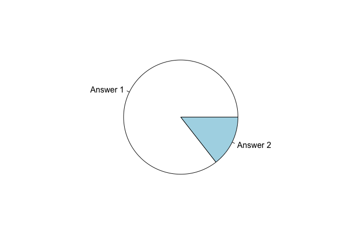
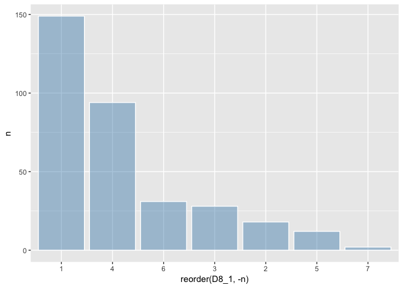

저출산 문제의 근원에 대한 분석
================

1. 요약(초록)
-------------

사회에서 문제되고 있는 저출산의 문제의 근원 즉, 아이낳기를 꺼려하는 가정들의 그 이유에 대한 분석을 하고자 '희망하는 자녀의 수 보다 적게낳았다'라고 응답한 가정을 대상으로 그 원인을 분석하였고, 다수응답자 순으로 1. 경제적부담 2. 건강 때문 등의 이유로 결과가 나타났다

결과적으로 '경제문제'가 아이낳기 꺼려하는 가정의 가장 큰 이유로 선정되었고, 이를 해결하기 위해선 기혼 가구에 대해 정부의 출산장려금 지원 등, 경제적 지원에 대한 복지 시스템 구축 및 복지 혜택 증설이 필요하다는 결론을 내렸다.

2. 분석 주제
------------

#### 문제 인식

우리나라에서 꾸준히 사회적으로 문제가 되고 있는 것이 바로 '저출산 문제'이다. 저출산 문제는 사회에 다음과 같은 문제들을 불러일으킨다.

의학의 발전에 따라 평균 기대수명 또한 증가하고 있는 추세이기 때문에 인구 고령화로 인한 노인들의 복지시설 부족의 문제, 그리고 생산가능인구의 감소로 인한 국가 경제의 타격 등 여러가지 문제들로 인해 결과적으로 국가 전체의 경쟁력을 약화시키는 문제를 초래한다.

#### 알아보고자 하는 것

이 분석을 통해 필자는 서울시에 거주하는 가구들이 무엇때문에 출산을 망설이는지, 또한 계획한 만큼 자녀를 낳는데에 있어서 걸림돌이 되는것은 무엇인지 그 이유들에 대하여 분석해보고자 한다.

3. 데이터 선정
--------------

데이터는 '서울연구데이터서비스' <http://data.si.re.kr/sisurvey2015er17> 에서 제공하는 '2015서울복지실태조사'를 사용하였다.

데이터 특성 : 본 데이터는 서울시 인구를 대상으로 복지실태에 대해 조사한 가구단위의 설문(패널)의 응답으로 구성되어있다. 데이터는 가구별 소득수준, 부채현황, 복지시스템에 대한 개선 희망사항 등에 대한 응답들을 포함하고 있으며, 이는 서울시 각 가구에 대한 분석을 하기에 적합한 데이터라고 생각한다.

4. 분석
-------

#### 분석목적 및 방법

데이터 내의 '귀댁은 희망하는 만큼 자녀를 낳으셨습니까?' 항목에 대해 '희망하는 자녀의 수보다 적게 낳았다'라고 답변한 사람들을 대상으로 이 이유에 대한 변수를 사용하여 빈도 수가 가장 높게나온 항목부터 내림차 순으로 정렬하여 확인하려고 한다.

###### 분석 전 패키지 로드하기

데이터 분석에 필요한 패키지를 로드한다. 분석에 사용될 패키지는 코드입력에 필요한 dplyr, 그래프 작성에 필요한 ggplot2, 엑셀로 이루어진 데이터를 읽어들이기 위한 readxl 이 세가지를 로드한다.

``` r
library("dplyr")
library("ggplot2")
library("readxl")
```

#### 변수검토 및 전처리

필자의 컴퓨터는 맥 운영체제여서 R스튜디오에서 한글을 인식하지 못하는 오류가 있다. 그래서 우선적으로 로컬언어를 한글로 바꿔주는 코드를 추가 삽입하였다.

``` r
Sys.setlocale('LC_ALL', 'ko_KR.UTF-8')
```

    ## [1] "ko_KR.UTF-8/ko_KR.UTF-8/ko_KR.UTF-8/C/ko_KR.UTF-8/C"

data라는 이름의 변수에 엑셀 데이터를 불러온다.

``` r
data <- read_excel("2015_서울복지실태조사_데이터.xlsx")
```

그 다음, 함수를 사용하여 데이터 속성에 대해 알아본다.

``` r
str(data)
```

    ## Classes 'tbl_df', 'tbl' and 'data.frame':    3019 obs. of  828 variables:
    ##  $ ID          : num  2 3 4 5 6 7 8 9 10 11 ...
    ##  $ fff_wgt     : num  1473 1460 322 655 588 ...
    ##  $ s_wgt       : num  1.269 1.258 0.277 0.564 0.506 ...
    ##  $ area        : num  3 5 3 3 3 3 3 3 3 3 ...
    ##  $ respondent  : num  1 2 2 1 1 2 1 1 1 1 ...
    ##  $ A1_2_1      : num  1 1 1 1 1 1 1 1 1 1 ...
    ##  $ A1_2_2      : num  2 2 2 2 3 2 3 3 2 2 ...
    ##  $ A1_2_3      : num  3 3 3 3 NA NA 3 NA 3 3 ...
    ##  $ A1_2_4      : num  3 NA NA 3 NA NA NA NA 3 3 ...
    ##  $ A1_2_5      : num  NA NA NA NA NA NA NA NA NA NA ...
    ##  $ A1_2_6      : num  NA NA NA NA NA NA NA NA NA NA ...
    ##  $ A1_2_7      : num  NA NA NA NA NA NA NA NA NA NA ...
    ##  $ A1_2_8      : logi  NA NA NA NA NA NA ...
    ##  $ A1_2_9      : logi  NA NA NA NA NA NA ...
    ##  $ A1_2_10     : logi  NA NA NA NA NA NA ...
    ##  $ A1_3_1      : num  1 1 1 1 2 1 2 2 1 1 ...
    ##  $ A1_3_2      : num  2 2 2 2 2 2 1 1 2 2 ...
    ##  $ A1_3_3      : num  1 1 1 2 NA NA 2 NA 1 1 ...
    ##  $ A1_3_4      : num  2 NA NA 2 NA NA NA NA 2 2 ...
    ##  $ A1_3_5      : num  NA NA NA NA NA NA NA NA NA NA ...
    ##  $ A1_3_6      : num  NA NA NA NA NA NA NA NA NA NA ...
    ##  $ A1_3_7      : num  NA NA NA NA NA NA NA NA NA NA ...
    ##  $ A1_3_8      : logi  NA NA NA NA NA NA ...
    ##  $ A1_3_9      : logi  NA NA NA NA NA NA ...
    ##  $ A1_3_10     : logi  NA NA NA NA NA NA ...
    ##  $ A1_4_1_1    : num  1954 1950 1964 1962 1966 ...
    ##  $ A1_4_1_2    : num  1958 1955 1996 1962 1995 ...
    ##  $ A1_4_1_3    : num  1984 1989 1992 1985 NA ...
    ##  $ A1_4_1_4    : num  1986 NA NA 1988 NA ...
    ##  $ A1_4_1_5    : num  NA NA NA NA NA NA NA NA NA NA ...
    ##  $ A1_4_1_6    : num  NA NA NA NA NA NA NA NA NA NA ...
    ##  $ A1_4_1_7    : num  NA NA NA NA NA NA NA NA NA NA ...
    ##  $ A1_4_1_8    : logi  NA NA NA NA NA NA ...
    ##  $ A1_4_1_9    : logi  NA NA NA NA NA NA ...
    ##  $ A1_4_1_10   : logi  NA NA NA NA NA NA ...
    ##  $ A1_4_2_1    : num  7 1 7 2 4 8 8 6 12 11 ...
    ##  $ A1_4_2_2    : num  6 9 5 3 8 11 9 3 1 3 ...
    ##  $ A1_4_2_3    : num  9 2 10 7 NA NA 2 NA 5 5 ...
    ##  $ A1_4_2_4    : num  8 NA NA 5 NA NA NA NA 8 2 ...
    ##  $ A1_4_2_5    : num  NA NA NA NA NA NA NA NA NA NA ...
    ##  $ A1_4_2_6    : num  NA NA NA NA NA NA NA NA NA NA ...
    ##  $ A1_4_2_7    : num  NA NA NA NA NA NA NA NA NA NA ...
    ##  $ A1_4_2_8    : logi  NA NA NA NA NA NA ...
    ##  $ A1_4_2_9    : logi  NA NA NA NA NA NA ...
    ##  $ A1_4_2_10   : logi  NA NA NA NA NA NA ...
    ##  $ age_1       : num  61 65 51 53 49 77 58 49 50 50 ...
    ##  $ age_2       : num  57 60 19 53 20 71 28 19 49 48 ...
    ##  $ age_3       : num  31 26 23 30 NA NA 25 NA 22 21 ...
    ##  $ age_4       : num  29 NA NA 27 NA NA NA NA 20 22 ...
    ##  $ age_5       : num  NA NA NA NA NA NA NA NA NA NA ...
    ##  $ age_6       : num  NA NA NA NA NA NA NA NA NA NA ...
    ##  $ age_7       : num  NA NA NA NA NA NA NA NA NA NA ...
    ##  $ age_8       : logi  NA NA NA NA NA NA ...
    ##  $ age_9       : logi  NA NA NA NA NA NA ...
    ##  $ age_10      : logi  NA NA NA NA NA NA ...
    ##  $ A1_5_1      : num  1 1 1 1 1 1 1 1 1 1 ...
    ##  $ A1_5_2      : num  1 1 1 1 1 1 1 1 1 1 ...
    ##  $ A1_5_3      : num  1 1 1 1 NA NA 1 NA 1 1 ...
    ##  $ A1_5_4      : num  1 NA NA 1 NA NA NA NA 1 1 ...
    ##  $ A1_5_5      : num  NA NA NA NA NA NA NA NA NA NA ...
    ##  $ A1_5_6      : num  NA NA NA NA NA NA NA NA NA NA ...
    ##  $ A1_5_7      : num  NA NA NA NA NA NA NA NA NA NA ...
    ##  $ A1_5_8      : logi  NA NA NA NA NA NA ...
    ##  $ A1_5_9      : logi  NA NA NA NA NA NA ...
    ##  $ A1_5_10     : logi  NA NA NA NA NA NA ...
    ##  $ A1_6_1      : num  5 5 6 5 5 3 5 5 5 5 ...
    ##  $ A1_7_1      : num  5 5 5 5 5 5 5 5 5 5 ...
    ##  $ A1_8_1      : num  1 1 1 1 3 1 2 3 1 1 ...
    ##  $ A1_9_1      : num  1 1 1 1 1 1 1 1 1 1 ...
    ##  $ A1_6_2      : num  5 5 7 5 5 3 7 5 5 5 ...
    ##  $ A1_7_2      : num  5 5 5 5 5 5 5 5 5 5 ...
    ##  $ A1_8_2      : num  1 1 1 1 5 1 5 5 1 1 ...
    ##  $ A1_9_2      : num  1 1 1 1 1 1 1 1 1 1 ...
    ##  $ A1_6_3      : num  5 5 7 6 NA NA 7 NA 7 5 ...
    ##  $ A1_7_3      : num  5 5 1 5 NA NA 5 NA 1 5 ...
    ##  $ A1_8_3      : num  5 5 5 5 NA NA 5 NA 5 5 ...
    ##  $ A1_9_3      : num  1 1 1 1 NA NA 1 NA 1 1 ...
    ##  $ A1_6_4      : num  6 NA NA 6 NA NA NA NA 7 7 ...
    ##  $ A1_7_4      : num  5 NA NA 5 NA NA NA NA 1 1 ...
    ##  $ A1_8_4      : num  5 NA NA 5 NA NA NA NA 5 5 ...
    ##  $ A1_9_4      : num  1 NA NA 1 NA NA NA NA 1 1 ...
    ##  $ A1_6_5      : num  NA NA NA NA NA NA NA NA NA NA ...
    ##  $ A1_7_5      : num  NA NA NA NA NA NA NA NA NA NA ...
    ##  $ A1_8_5      : num  NA NA NA NA NA NA NA NA NA NA ...
    ##  $ A1_9_5      : num  NA NA NA NA NA NA NA NA NA NA ...
    ##  $ A1_6_6      : num  NA NA NA NA NA NA NA NA NA NA ...
    ##  $ A1_7_6      : num  NA NA NA NA NA NA NA NA NA NA ...
    ##  $ A1_8_6      : num  NA NA NA NA NA NA NA NA NA NA ...
    ##  $ A1_9_6      : num  NA NA NA NA NA NA NA NA NA NA ...
    ##  $ A1_6_7      : num  NA NA NA NA NA NA NA NA NA NA ...
    ##  $ A1_7_7      : num  NA NA NA NA NA NA NA NA NA NA ...
    ##  $ A1_8_7      : num  NA NA NA NA NA NA NA NA NA NA ...
    ##  $ A1_9_7      : num  NA NA NA NA NA NA NA NA NA NA ...
    ##  $ A1_6_8      : logi  NA NA NA NA NA NA ...
    ##  $ A1_7_8      : logi  NA NA NA NA NA NA ...
    ##  $ A1_8_8      : logi  NA NA NA NA NA NA ...
    ##  $ A1_9_8      : logi  NA NA NA NA NA NA ...
    ##  $ A1_6_9      : logi  NA NA NA NA NA NA ...
    ##  $ A1_7_9      : logi  NA NA NA NA NA NA ...
    ##   [list output truncated]

``` r
dim(data)
```

    ## [1] 3019  828

본 데이터는 대부분 숫자로 이루어져있고, 각 변수들은 결측값 또한 포함하고 있음을 알 수 있으며, 데이터는 총 행렬이 3019 X 828구조로 되어있음을 알 수 있다. 또한 각 변수들은 설문 항목에 대한 응답을 의미한다.

#### 분석 및 해석

먼저 데이터 코드북을 참고하여 필요한 데이터를 추출해야한다. 분석에 필요한 데이터는 문항 D8의 '계획한만큼 자녀를 낳았는가'에 대한 응답과 문항 D8\_1 '계획한만큼 낳지 못했다면 그 이유는 무엇인가'에 대한 응답이다. 변수명과 설문 문항번호가 일치하므로 변수명을 그대로 사용하면 된다.

우선적으로, 필자가 알아보려는 D8문항의 2번 '계획한만큼 낳지 못하였다'에 응답한 데이터가 몇 개 인지 알아보았다.

``` r
data %>% 
  filter(D8 == 2) %>% 
  select(D8) %>% 
  summarise(n=n())
```

    ## # A tibble: 1 x 1
    ##       n
    ##   <int>
    ## 1   334

결과와 같이 334가구로 집계됨을 볼 수 있다.

그 다음 0번 '자녀가 없음'항목에 응답한 데이터를 제외하고, 전체 자녀가 있는 가구 중에 2번에 응답한 가구가 몇 퍼센트를 차지하는지 분석해 보았다.

``` r
janyeo <- data %>% 
  filter(D8 != 0) %>% 
  summarise(n=n())
data %>% 
  filter(D8 == 2) %>% 
  summarise(n=n()) %>% 
  mutate(D8_per = n/janyeo*100) %>% 
  select(D8_per)
```

    ## # A tibble: 1 x 1
    ##   D8_per          
    ##   <data.frame>    
    ## 1 14.4526179143228

그 결과 계획한 만큼 아이를 낳지 못한 가구는 전체의 14.5%를 차지하고 있음을 알 수 있다.

그렇다면 그 이유는 무엇일까? D8\_1 변수를 이용하여 그에 대한 답을 찾기위해 응답 빈도수를 분석하였다.

``` r
data_res <- data %>% 
  filter(D8 == 2) %>% 
  group_by(D8_1) %>% 
  summarise(n=n()) %>% 
  arrange(desc(n))
```

그 결과 자녀를 계획한 만큼 낳지 못한 이유를 가장 많은 가구들이 1번이라고 답했고, 4번 - 6번 - 3번 - 2번 - 5번 - 7번 순으로 답하였다.

코드북을 참고하여 결과로 나온 각 번호에 대한 응답을 찾아보면 다음과 같다.

1번 : 경제적 부담 / 2번 : 아이엄마 직장생활의 어려움 / 3번 : 적절한 보육시설, 서비스가 갖춰져있지 않음 / 4번 : 건강 때문에 / 5번 : 자녀보다 부부생활이 중요하므로 / 6번 : 앞으로 낳을 계획이기 때문에 / 7번 : 기타

결과적으로 자녀를 둔 가구가 자녀를 계획한 만큼 낳지 못한 가장 큰 이유는 1번 '경제적 부담' 으로 분석되었다.

###### 그래프 분석

우선, 원하는 만큼 자녀를 낳지 못했다고 응답한 가구의 비율이 전체에서 얼마나 차지하는지에 대한 분석을 알아보기 쉽도록 파이그래프를 통해 나타내 보았다.

``` r
data_per <- data %>% 
  filter(D8 != 0) %>% 
  select(D8) %>% 
  group_by(D8) %>% 
  summarise(n=n())
pie(data_per$n, labels = c("Answer 1","Answer 2"))
```



다음 그래프와 같이 D8문항 2번에 응답한(원하는 만큼 아이를 낳지 못함) 가구는 전체의 14%정도 차지함을 볼 수 있다.

그리고 D8문항 2번에 응답한 가구들을 대상으로 아이를 원하는 만큼 낳지못한 이유에 대한 변수 D8\_1에 대한 빈도수를 그래프를 통하여 나타내보았다.

``` r
ggplot(data = data_res, aes(x = reorder(D8_1, -n), y = n)) + geom_col(color="white", fill=rgb(0.2,0.5,0.7,0.4))
```



1번 : 경제적 부담 / 2번 : 아이엄마 직장생활의 어려움 / 3번 : 적절한 보육시설, 서비스가 갖춰져있지 않음 / 4번 : 건강 때문에 / 5번 : 자녀보다 부부생활이 중요하므로 / 6번 : 앞으로 낳을 계획이기 때문에 / 7번 : 기타

보이는 바와 같이 가장많은 이유로 꼽힌 것은 '1번 : 경제적 문제'임을 볼 수 있다.

5. 논의 : 한계점, 비판점, 추후 분석 방향
----------------------------------------

서울시에 거주하는 가구들 만을 대상으로 분석이 이루어졌다는 점이 아쉬웠다. 전 지역별 데이터를 통합하여 전국 단위의 데이터분석이 이루어졌다면 과연 결과가 달라졌을까 하는 의문이 든다.
