leisure report
================
team2
2018년 6월 6일

**소득에 따른 여가 지출비 동향 분석**
=====================================

Ⅰ. 도입
-------

### 1. 요약(초록)

가장 먼저, 선정된 다섯 개의 여가 활동 별로 나누어 각각의 지출 형태(평균, 최솟값, 중앙값, 최댓값)와 경상소득과의 관계를 알아보았다. 다음으론 가구원의 수와 취업 중인 가구원의 수 또한 여가 지출에 영향을 미칠 것이라 판단하여 이를 경상소득 별로 알아보고 경상소득별 여가 지출 비중 분석, 경상소득별 1인당 여가 지출 분석, 경상소득별 1인당 여가 지출 비중 분석을 해보았다. 세 번째 학력별, 네 번째로는 직종별로 나누어 여가 지출을 분석함으로써 여가 지출에 영향을 미치는 여러 변수들을 알아보고자 하였다. 분석 결과, 실제로 소득이 많아질수록 여가에 지출하는 비용이 증가하는 것으로 나타났다. 이는 고학력일 때와 흔히 고소득으로 평가되는 직종일 때에도 동일하게 나타났다.

### 2. 분석 주제

현재의 대한민국은 소득 불균형이 심각한 상황이다. 중산층은 몰락했고 계속된 빈익빈 부익부 현상은 국민들로 하여금 근로 의욕을 상실하게 만들었다. 이러한 상황에서 소위 ‘잘 사는’ 사람들과 그렇지 않은 사람들의 여가 또한 따로 존재한다는 것이 일반적인 생각이다. 때문에 우리는 본 분석을 통해 실제로 소득에 따라 여가의 모습이 달라지는지를 비롯해 여가에 영향을 주는 다양한 요인들을 밝히고, 우리 사회의 여가 양상을 알아볼 것이다.

### 3. 데이터 선정 이유

해당 데이터는 한국조세재정연구원([http://panel.kipf.re.kr/Data/Data\#TR\_56)의](http://panel.kipf.re.kr/Data/Data#TR_56)의) 9차년도(2016년) 재정패널조사로, 가공되지 않은 raw 데이터이다. 제주도를 제외한 전국 15개 시도에 거주하고 있는 일반 가구와 가구원을 모집단으로 하는데, 데이터는 가구용, 가구원용 총 두 가지로 나뉘어 제공된다. 우리는 특히 여가와 소득의 관계에 관심을 두고 있기 때문에 일반적인 소득 분위가 가구단위로 결정된다는 점을 고려하여 가구용 데이터를 선정하게 되었다. 데이터는 가구 기본 현황, 재산 상황, 가계 지출 현황 등의 내용을 담고 있다.

------------------------------------------------------------------------

Ⅱ. 분석
-------

### 1. 분석 목적 및 방법

첫 번째로 여가 종류별 지출을 분석했다. 여가의 종류 각각의 특성을 알아보고, 그다음 경상소득과의 유의미한 관계를 찾고자 경상소득에 따른 여가별 지출 동향을 분석, 이를 검증하기 위한 상관분석의 순서로 진행했다. 두 번째로는 가구원 수, 취업 중 가구원 수라는 변수를 추가했다. 이를 통해 여가별 1인당 여가 지출과 경상소득별 1인당 여가 지출 비중을 분석했다. 세 번째 분석에서는 가구주의 최종학력과 여가의 관계를 알아보고자 했다. 졸업 여부 변수를 이용해 수료와 졸업 상태인 집단만을 선별했으며 여가 종류별 학력 요인의 영향을 분석한 다음, 학력별 여가 지출 금액, 학력별 여가 지출 비중을 분석했다. 네 번째 분석인 직종별 여가 지출도 비슷한 방식으로 진행되었는데, 이를 통해 직종별 여가 지출과 직종별 여가 지출 비중을 분석했다.

### 2. 데이터 분석 준비하기

#### 패키지 로드하기

``` r
library(dplyr)
library(ggplot2)
```

#### 데이터 불러오기

``` r
data <- read.csv("NaSTaB09H.csv")
```

#### 변수명 바꾸기

변수 검토에 전 분석에 사용할 변수의 알아보기 쉽게 바꿨다.

``` r
data <- rename(data,
               income = h09ca001,                 #경상소득 
               dvd_spend_yesno = h09ch001,        #서적, 음반, DVD 등 구입 및 대여료 지출 여부
               dvd_spend = h09ch002,              #서적, 음반, DVD 등 구입 및 대여료
               movie_spend_yesno = h09ch003,      #박물관, 공연, 영화 관람료 지출 여부
               movie_spend = h09ch004,            #박물관, 공연, 영화 관람료
               race_spend_yesno = h09ch005,       #경륜, 경정, 경마권 구입료 지출 여부
               race_spend = h09ch006,             #경륜, 경정, 경마권 구입료       
               activity_spend_yesno = h09ch012,   #체육, 음악, 문화 활동비 지출(수강료, 동호회비 등 포함) 여부
               activity_spend = h09ch013,         #체육, 음악, 문화 활동비 지출(수강료, 동호회비 등 포함)
               trip_spend_yesno = h09cn001,       #관광, 여행 및 숙박료(국내 및 국외) 지출 여부
               trip_spend = h09cn002,             #관광, 여행 및 숙박료(국내 및 국외)        
               member_n = h09aa007,               #가구원 수  
               member_income = h09aa008)          #취업 중인 가구원 수 
```

### 3. 데이터 분석

### 1) 여가 종류별 지출 금액 분석

#### (1) 서적, 음반, DVD 등 구입 및 대여료

#### (1)-1. h1\_1 '서적, 음반, DVD 등 구입 및 대여료' 변수 검토 및 전처리

``` r
#응답값 확인
table(data$dvd_spend)
```

    ## 
    ##    -9   0.1   0.2   0.5   0.8     1   1.1   1.5     2   2.5   2.7     3 
    ##     1     1     1     1     1    17     2     6    46     3     1    85 
    ##   3.3   3.5     4   4.5   4.8     5   5.5     6   6.5     7     8   8.7 
    ##     1     5    13     3     1   227     9    13     2    13    10     1 
    ##    10  10.5    11    12  12.5    13  13.3    15  15.5    16    17    18 
    ##   384     2     3    33     2     1     1   112     3     2     1     4 
    ##    20  20.4  20.5    22    23    24    25    30    32  32.5  34.2    35 
    ##   242     1     1     2     2    17    26   176     2     1     1     5 
    ##    36    37    38    40    45    48    50    55    60    62    65    70 
    ##    23     1     1    41     3     5   117     2    48     1     3     9 
    ##    72    73    74    75    77    80    82    84    85    90    95   100 
    ##     3     1     1     1     1     5     1     3     2     2     1    59 
    ##   110   115   120 122.2   130   140   145   150   160   168   170   180 
    ##     1     1    31     1     1     2     1    16     1     1     1     3 
    ##   200   240   300   330   350   400   500   700  1000 
    ##    14     3    10     1     1     1     1     1     1

``` r
#존재할 수 없는 값(이상치)-무응답 값(-9로 표기)을 결측 처리
data$dvd_spend <- ifelse(data$dvd_spend == -9, NA, data$dvd_spend)
#결측치 개수 확인
table(is.na(data$dvd_spend))
```

    ## 
    ## FALSE  TRUE 
    ##  1913  2919

``` r
#이상치 제거
boxplot(data$dvd_spend)$stats
```


    ##      [,1]
    ## [1,]  0.1
    ## [2,] 10.0
    ## [3,] 15.0
    ## [4,] 30.0
    ## [5,] 60.0

``` r
data$dvd_spend <- ifelse(data$dvd_spend < 0.1 | data$dvd_spend > 60, NA, data$dvd_spend)
```

#### (1)-2. 지출 여부에 '예'라고 답한 사람들의 평균 지출액, 지출액의 최솟값, 중앙값, 최댓값 구하기

``` r
dvd <- data %>% 
  filter(dvd_spend_yesno == 1)
summary(dvd$dvd_spend)
```

    ##    Min. 1st Qu.  Median    Mean 3rd Qu.    Max.    NA's 
    ##    0.10    6.00   12.00   18.24   25.00   60.00     187

평균은 18.24만 원, 최솟값은 0.1만 원, 중앙값은 평균보다 작은 12만 원, 최댓값은 60만 원이다.

#### (1)-3. 경상소득에 따른 dvd\_spend 지출 동향 분석 및 그래프 출력하기

``` r
data_dvd <- data %>% 
  filter(dvd_spend_yesno == 1) %>% 
  group_by(income) %>% 
  summarise(mean_dvd = mean(dvd_spend, na.rm = T))
data_dvd
```

    ## # A tibble: 11 x 2
    ##    income mean_dvd
    ##     <int>    <dbl>
    ##  1      1     6.06
    ##  2      2    10.7 
    ##  3      3    14.4 
    ##  4      4    16.7 
    ##  5      5    16.9 
    ##  6      6    20.3 
    ##  7      7    20.5 
    ##  8      8    21.6 
    ##  9      9    20.0 
    ## 10     10    18.9 
    ## 11     11    26.5

``` r
ggplot(data = data_dvd, aes(x = income, y = mean_dvd)) + geom_col(color = "white", fill = rgb(0.2,0.5,0.7,0.5))
```

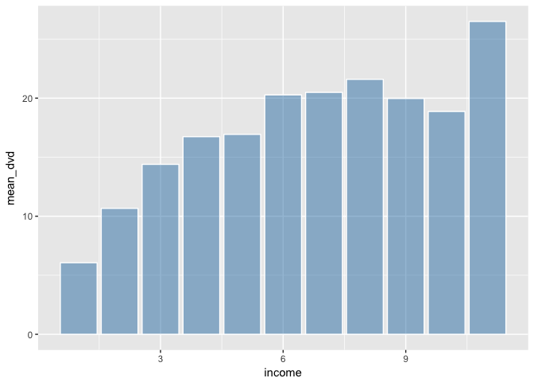

#### (1)-4. 상관분석

``` r
cor.test(data$income, data$dvd_spend)
```

    ## 
    ##  Pearson's product-moment correlation
    ## 
    ## data:  data$income and data$dvd_spend
    ## t = 9.8869, df = 1725, p-value < 2.2e-16
    ## alternative hypothesis: true correlation is not equal to 0
    ## 95 percent confidence interval:
    ##  0.1864449 0.2757345
    ## sample estimates:
    ##       cor 
    ## 0.2315773

p 값이 0.05보다 작으므로 유의미하다 할 수 있다. cor 값이 양수이므로 `경상소득`과 `서적, 음반, DVD 등 구입 및 대여료`는 정적 관계이다.

#### (2) 박물관, 공연, 영화 관람료

#### (2)-1. h2\_1 '박물관, 공연, 영화 관람료' 변수 검토 및 전처리

``` r
#응답값 확인
table(data$movie_spend)
```

    ## 
    ##  0.3  0.5  0.6  0.7  0.8    1  1.1  1.2  1.4  1.5  1.6  1.8    2  2.1  2.4 
    ##    1    2    1    1    3   20    1    3    2    8    6    6   67    1   16 
    ##  2.5  2.7  2.8    3  3.2  3.4  3.5  3.6  3.7  3.8    4  4.1  4.2  4.5  4.6 
    ##   19    2    2   99    5    1    5    8    1    1   70    1    2    8    1 
    ##  4.8    5  5.4  5.5    6  6.5    7  7.2  7.5  7.6    8  8.2  8.4    9  9.6 
    ##    8  322    6    8   78    4   29    1    4    1   36    1    2    6    2 
    ##   10 10.5 10.8   11   12 12.5   13   14 14.4 14.5   15   16 16.8   17 17.5 
    ##  626    1    1    1   85    1    6    7    1    1  173    7    1    1    1 
    ##   18 19.2   20 20.1 21.6   22   24   25 25.8   26 26.8   28   30   31   32 
    ##    6    1  297    1    3    2   28   31    1    1    1    2  131    1    1 
    ## 33.6   35   36   37   38   40   43   45   48   50   55   60   70   72   80 
    ##    1    9   17    1    2   32    1    4    3   60    2   24    6    1    7 
    ##   90  100  120  185  300  400 
    ##    3   15    8    1    1    1

``` r
#결측치 개수 확인
table(is.na(data$movie_spend))
```

    ## 
    ## FALSE  TRUE 
    ##  2490  2342

``` r
#이상치 제거
boxplot(data$movie_spend)$stats
```


    ##      [,1]
    ## [1,]  0.3
    ## [2,]  5.0
    ## [3,] 10.0
    ## [4,] 20.0
    ## [5,] 40.0

``` r
data$movie_spend <- ifelse(data$movie_spend < 0.3 | data$movie_spend > 40, NA, data$movie_spend)
```

#### (2)-2. 지출 여부에 '예'라고 답한 사람들의 평균 지출액, 지출액의 최솟값, 중앙값, 최댓값 구하기

``` r
movie <- data %>% 
  filter(movie_spend_yesno == 1)
summary(movie$movie_spend)
```

    ##    Min. 1st Qu.  Median    Mean 3rd Qu.    Max.    NA's 
    ##    0.30    5.00   10.00   12.01   15.00   40.00     137

평균은 12.01만 원, 최솟값은 0.3만 원, 중앙값은 평균보다 작은 10만 원, 최댓값은 40만 원이다.

#### (2)-3. 경상소득에 따른 movie\_spend 지출 동향 분석 및 그래프 출력하기

``` r
data_movie <- data %>% 
  filter(movie_spend_yesno == 1) %>% 
  group_by(income) %>% 
  summarise(mean_movie = mean(movie_spend, na.rm = T))
data_movie
```

    ## # A tibble: 11 x 2
    ##    income mean_movie
    ##     <int>      <dbl>
    ##  1      1       7.97
    ##  2      2       7.61
    ##  3      3       8.47
    ##  4      4      11.2 
    ##  5      5      11.8 
    ##  6      6      12.5 
    ##  7      7      14.2 
    ##  8      8      14.3 
    ##  9      9      15.1 
    ## 10     10      17.8 
    ## 11     11      17.1

``` r
ggplot(data = data_movie, aes(x = income, y = mean_movie)) + geom_col(color = "white", fill = rgb(0.2,0.7,0.2,0.5))
```


#### (2)-4. 상관분석

``` r
cor.test(data$income, data$movie_spend)
```

    ## 
    ##  Pearson's product-moment correlation
    ## 
    ## data:  data$income and data$movie_spend
    ## t = 15.474, df = 2351, p-value < 2.2e-16
    ## alternative hypothesis: true correlation is not equal to 0
    ## 95 percent confidence interval:
    ##  0.2668966 0.3402554
    ## sample estimates:
    ##       cor 
    ## 0.3040266

p 값이 0.05보다 작으므로 유의미하다 할 수 있다. cor 값이 양수이므로 `경상소득`과 `박물관, 공연, 영화 관람료`는 정적 관계이다.

#### (3) 경륜, 경정, 경마권 구입료

#### (3)-1. h3\_1 '경륜, 경정, 경마권 구입료' 변수 검토 및 전처리

``` r
#응답값 확인
table(data$race_spend)
```

    ## 
    ## 1.5  10  20 200 
    ##   1   1   1   1

``` r
#결측치 개수 확인
table(is.na(data$race_spend))
```

    ## 
    ## FALSE  TRUE 
    ##     4  4828

응답한 가구가 4가구 밖에 되지 않아 분석이 무의미하다고 판단하여 분석에서 배제하였다.

#### (3)-2. 상관분석

``` r
cor.test(data$income, data$race_spend)
```

    ## 
    ##  Pearson's product-moment correlation
    ## 
    ## data:  data$income and data$race_spend
    ## t = -0.4617, df = 2, p-value = 0.6896
    ## alternative hypothesis: true correlation is not equal to 0
    ## 95 percent confidence interval:
    ##  -0.9793293  0.9273369
    ## sample estimates:
    ##        cor 
    ## -0.3103509

p값이 0.05보다 크므로 무의미하다.

#### (4) 체육, 음악, 문화 활동비 지출(수강료, 동호회비 등 포함)

#### (4)-1. h6\_1 '체육, 음악, 문화 활동비 지출(수강료, 동호회비 등 포함)' 변수 검토 및 전처리

``` r
#응답값 확인
table(data$activity_spend)
```

    ## 
    ##    1    2    3  3.5    4  4.5    5  5.5    6    8  8.4    9   10   11   12 
    ##    1    3    4    1    1    1    6    1    3    1    1    1   38    2   18 
    ## 12.4   13   14   15   16   18   20 20.5   21   24   25 27.6   28   30   32 
    ##    1    1    3    9    1    6   31    1    1   11    6    1    1   51    1 
    ##   33   35   36   38   39   40   42   43   45   48   50   51   54 54.5   55 
    ##    2    2   21    2    1   16    1    2    2   14   35    1    2    1    3 
    ##   57   58   60   62   64 64.8   66   70   72   74   75   76   80   84   85 
    ##    1    2   66    1    2    1    2    8   20    1    1    2   10   10    3 
    ##   90   96   98  100  102  110  114  118  120  132  140  144  145  148  150 
    ##    6    8    1   41    1    1    2    1   52    1    2    8    1    1   14 
    ##  160  162  168  176  180  190  198  200  216  220  230  240  245  250  260 
    ##    1    1    2    1   11    1    1   19    1    2    1   20    1    8    1 
    ##  264  268  288  300  320  350  360  372  380  400  450  480  550  600  720 
    ##    1    1    1    8    1    3    9    1    1    4    1    1    1    6    1 
    ##  800  816  900 1200 
    ##    1    1    3    1

``` r
#결측치 개수 확인
table(is.na(data$activity_spend))
```

    ## 
    ## FALSE  TRUE 
    ##   699  4133

``` r
#이상치 제거
boxplot(data$activity_spend)$stats
```


    ##      [,1]
    ## [1,]    1
    ## [2,]   30
    ## [3,]   60
    ## [4,]  120
    ## [5,]  250

``` r
data$activity_spend <- ifelse(data$activity_spend < 1 | data$activity_spend > 250, NA, data$activity_spend)
```

#### (4)-2. 지출 여부에 '예'라고 답한 사람들의 평균 지출액, 지출액의 최솟값, 중앙값, 최댓값 구하기

``` r
activity <- data %>% 
  filter(activity_spend_yesno == 1)
summary(activity$activity_spend)
```

    ##    Min. 1st Qu.  Median    Mean 3rd Qu.    Max.    NA's 
    ##    1.00   30.00   60.00   74.11  100.00  250.00      47

평균은 74.11만 원, 최솟값은 1만 원, 중앙값은 평균보다 작은 60만 원, 최댓값은 250만 원이다.

#### (4)-3. 경상소득에 따른 activity\_spend 지출 동향 분석 및 그래프 출력하기

``` r
data_activity <- data %>% 
  filter(activity_spend_yesno == 1) %>% 
  group_by(income) %>% 
  summarise(mean_activity = mean(activity_spend, na.rm = T))
data_activity
```

    ## # A tibble: 11 x 2
    ##    income mean_activity
    ##     <int>         <dbl>
    ##  1      1          42.8
    ##  2      2          50.8
    ##  3      3          54.9
    ##  4      4          64.9
    ##  5      5          67.5
    ##  6      6          74.8
    ##  7      7          77.3
    ##  8      8          76.6
    ##  9      9          81.8
    ## 10     10         116. 
    ## 11     11         105.

``` r
ggplot(data = data_activity, aes(x = income, y = mean_activity)) + geom_col(color = "white", fill = rgb(0.8,0.2,0.2,0.5))
```


#### (4)-4. 상관분석

``` r
cor.test(data$income, data$activity_spend)
```

    ## 
    ##  Pearson's product-moment correlation
    ## 
    ## data:  data$income and data$activity_spend
    ## t = 6.5957, df = 650, p-value = 8.775e-11
    ## alternative hypothesis: true correlation is not equal to 0
    ## 95 percent confidence interval:
    ##  0.1770800 0.3210678
    ## sample estimates:
    ##       cor 
    ## 0.2504584

p값이 0.05보다 작으므로 유의미하다 할 수 있다. cor 값이 양수이므로 `경상소득`과 `체육, 음악, 문화 활동비 지출(수강료, 동호회비 등 포함)`는 정적 관계이다.

#### (5) 관광, 여행 및 숙박료(국내 및 국외)

#### (5)-1. n1\_1 '관광, 여행 및 숙박료(국내 및 국외)' 변수 검토 및 전처리

``` r
#응답값 확인
table(data$trip_spend)
```

    ## 
    ##   -9    1    2    3    4    5    6    7   10   15   16   20   21   23   24 
    ##    1    1    3    1    1   11    3    1   44    8    2   84    1    2    1 
    ##   25   28   30   35   40   45   50   60   70   75   78   80   85   90  100 
    ##    7    2  168    4   59    1  267   66   52    1    1   64    1    3  410 
    ##  101  105  116  120  126  130  140  145  150  155  160  170  175  180  185 
    ##    1    1    1   54    1   13   12    2  152    1    6    6    1   20    1 
    ##  190  200  210  220  230  240  245  250  260  270  280  290  300  310  315 
    ##    3  205    6    4    9   10    1   50    2    3    3    1  150    1    1 
    ##  320  330  335  350  360  370  380  390  400  415  420  425  430  450  470 
    ##    6    7    1   33    5    1    3    2   64    1    8    1    2   21    1 
    ##  480  500  520  525  535  550  555  560  570  580  590  600  640  650  660 
    ##    1   52    2    1    1   15    1    2    2    2    1   43    1   11    1 
    ##  680  700  720  730  750  800  820  830  850  880  900  904  960  980 1000 
    ##    2   21    1    3    2   20    1    1    9    1   12    1    1    1   22 
    ## 1050 1055 1080 1100 1120 1130 1200 1230 1250 1280 1300 1340 1350 1400 1500 
    ##    3    1    1    4    2    1   12    1    1    1    5    1    2    3    6 
    ## 1600 1650 1700 1800 1950 2000 2060 2100 2150 2200 2250 2300 2500 2600 2700 
    ##    5    4    4    1    1    4    1    4    1    1    1    1    1    1    1 
    ## 3000 5150 
    ##    1    1

``` r
#존재할 수 없는 값(이상치)-무응답 값(-9로 표기)을 결측 처리
data$trip_spend <- ifelse(data$trip_spend == -9, NA, data$trip_spend)
#결측치 개수 확인
table(is.na(data$trip_spend))
```

    ## 
    ## FALSE  TRUE 
    ##  2457  2375

``` r
#이상치 제거하기
boxplot(data$trip_spend)$stats
```

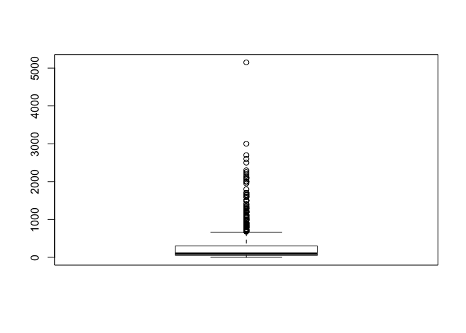

    ##      [,1]
    ## [1,]    1
    ## [2,]   50
    ## [3,]  100
    ## [4,]  300
    ## [5,]  660
    ## attr(,"class")
    ##         1 
    ## "integer"

``` r
data$trip_spend <- ifelse(data$trip_spend < 0 | data$trip_spend > 660, NA, data$trip_spend)
```

#### (5)-2. 지출 여부에 '예'라고 답한 사람들의 평균 지출액, 지출액의 최솟값, 중앙값, 최댓값 구하기

``` r
trip <- data %>% 
  filter(trip_spend_yesno == 1)
summary(trip$trip_spend)
```

    ##    Min. 1st Qu.  Median    Mean 3rd Qu.    Max.    NA's 
    ##       1      50     100     159     200     660     176

평균은 159만 원, 최솟값은 1만 원, 중앙값은 평균보다 작은 100만 원, 최댓값은 660만 원이다.

#### (5)-3. 경상소득에 따른 trip\_spend 지출 동향 분석 및 그래프 출력하기

``` r
data_trip <- data %>% 
  filter(trip_spend_yesno == 1) %>% 
  group_by(income) %>% 
  summarise(mean_trip = mean(trip_spend, na.rm = T))
data_trip
```

    ## # A tibble: 11 x 2
    ##    income mean_trip
    ##     <int>     <dbl>
    ##  1      1      53.0
    ##  2      2      87.2
    ##  3      3     124. 
    ##  4      4     130. 
    ##  5      5     158. 
    ##  6      6     172. 
    ##  7      7     195. 
    ##  8      8     222. 
    ##  9      9     227. 
    ## 10     10     250. 
    ## 11     11     272.

``` r
ggplot(data = data_trip, aes(x = income, y = mean_trip)) + geom_col(color = "white", fill = rgb(0.7,0.7,0.2,0.5))
```

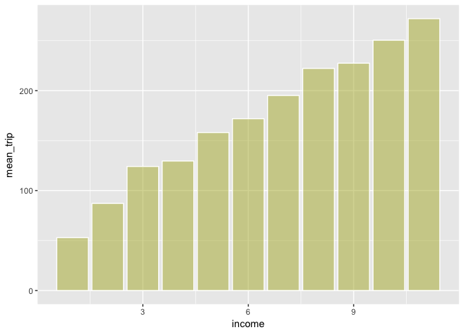

#### (5)-4. 상관분석

``` r
cor.test(data$income, data$trip_spend)
```

    ## 
    ##  Pearson's product-moment correlation
    ## 
    ## data:  data$income and data$trip_spend
    ## t = 17.946, df = 2280, p-value < 2.2e-16
    ## alternative hypothesis: true correlation is not equal to 0
    ## 95 percent confidence interval:
    ##  0.3153382 0.3872611
    ## sample estimates:
    ##       cor 
    ## 0.3518188

p 값이 0.05보다 작으므로 유의미하다 할 수 있다. cor 값이 양수이므로 `경상소득`과 `관광, 여행 및 숙박료(국내 및 국외)`는 정적 관계이다.

### 2) 가구원 수 및 경상소득별 여가 지출 차이

데이터가 가구 단위임을 고려하면 가구원 수에 따라 지출 금액이 달라질 수 있다. 때문에 경상 소득 별 가구원 수를 알아보았고, 또 경제활동을 하는 가구원의 수에 따라서도 여가 지출이 달라질 수 있을 것이라 판단하여 경상소득별 취업 중인 가구원 수를 알아보았다.

#### (1) 경상 소득별 가구당 가구원 수

``` r
data_member <- data %>% 
  filter(income != -9) %>% 
  group_by(income) %>% 
  summarise(mean_member = mean(member_n))
ggplot(data_member, aes(x = income, y = mean_member)) + geom_col(color = "white", fill = rgb(0.9,0.3,0,0.5))
```


6구간(월평균 경상소득 599만 원 이내)까지 가구당 평균 가구원 수가 증가하지만 이후 구간에서는 큰 차이를 보이지 않는다.

#### (2) 경상 소득별 가구당 취업 중인 가구원 수

``` r
data_working <- data %>% 
  filter(income != -9) %>% 
  group_by(income) %>% 
  summarise(mean_workingmember = mean(member_income))
ggplot(data_working, aes(x = income, y = mean_workingmember)) + geom_col(color = "white", fill = rgb(0.3,0.5,1,0.7))
```


소득에 따라 취업 중인 가구원의 수가 다소 크게 차이 난다. 대체적으로 취업 중인 가구원의 수가 많을수록 소득이 높은 양상을 보인다.

#### (3) 가구원 수 및 경상소득별 여가 지출 차이

#### (3)-1. 경상소득별 여가 지출 비중 분석

``` r
#모든 여가 변수 데이터 합치기
data_total <- left_join(data_dvd, data_movie, by = "income")
data_total <- left_join(data_total, data_activity, by = "income")
data_total <- left_join(data_total, data_trip, by = "income")
data_total <- data_total %>% 
  select(mean_dvd, mean_movie, mean_activity, mean_trip)

#종합 결과그래프 출력
rownames(data_total) = c("below 100","100~199","200~299","300~399","400~499","500~599","600~699","700~799","800~899","900~999","above 1000")
barplot(t(data_total), main = "Total Gragh", col = colors()[c(2,6,3,16)])
legend(0.1, 400, c("dvd", "movie", "activity", "trip"), fill = colors()[c(2,6,3,16)])
```

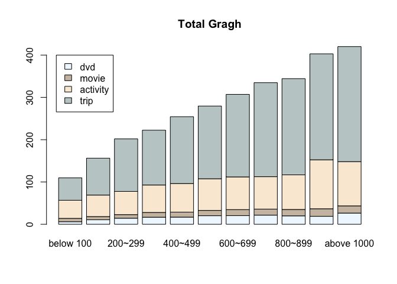

경상소득이 많을수록 여가 별 지출 비용도 증가한다. 소득에 관계없이 `관광, 여행 및 숙박료(국내 및 국외)`에 가장 많은 지출을 하고 있었고 그다음을 `체육, 음악, 문화 활동비 지출(수강료, 동호회비 등 포함)`가 잇는다. `서적, 음반, DVD 등 구입 및 대여료`와 `박물관, 공연, 영화 관람료`는 큰 차이 없이 적은 지출 비중을 차지했다.

#### (3)-2. 경상소득별 1인당 여가 지출 분석

가구원 수로 나눈(1인당 지출비) 종합 결과 그래프 출력하기 위해 여가 항목별 데이터 가공하기

``` r
#소득에 따른 1인당 서적, 음반, DVD 등 구입 및 대여료
data_total2 <- left_join(data_dvd, data_member, by = "income")
divided_dvd <- data_total2 %>% 
  mutate(member_dividing_dvd = mean_dvd / mean_member) %>% 
  select(income, member_dividing_dvd)
#소득에 따른 1인당 서적, 음반, DVD 등 구입 및 대여료 그래프
ggplot(data = divided_dvd, aes(x = income, y = member_dividing_dvd)) + geom_col(color="white", fill=rgb(0.2,0.5,0.7,0.5))
```


10구간(월평균 경상소득 999만 원 이내)까지는 특정한 흐름을 찾기 힘들다. 그러나 11구간(월평균 경상소득 1000만 원 이상)에서 유독 많은 지출이 발생한 것을 알 수 있다.

``` r
#소득에 따른 1인당 박물관, 공연, 영화 관람료
data_total3 <- left_join(data_movie, data_member, by = "income")
divided_movie <- data_total3 %>% 
  mutate(member_dividing_movie = mean_movie / mean_member) %>%
  select(income, member_dividing_movie)
#소득에 따른 1인당 박물관, 공연, 영화 관람료 그래프
ggplot(data = divided_movie, aes(x = income, y = member_dividing_movie)) + geom_col(color="white", fill=rgb(0.2,0.7,0.2,0.5))
```


3구간(월평균 경상소득 200~299만 원)부터 소득이 증가함에 따라 1인당 지출 금액이 늘어나는 양상이다. 특이하게 1구간(월평균 경상소득 100만 원 미만)에서 높은 지출을 기록한 여가이다.

``` r
#소득에 따른 1인당 체육, 음악, 문화 활동비 지출(수강료, 동호회비 등 포함)
data_total4 <- left_join(data_activity, data_member, by = "income")
divided_activity <- data_total4 %>% 
  mutate(member_dividing_activity = mean_activity / mean_member) %>%
  select(income, member_dividing_activity)
#소득에 따른 1인당 체육, 음악, 문화 활동비 지출(수강료, 동호회비 등 포함) 그래프
ggplot(data = divided_activity, aes(x = income, y = member_dividing_activity)) + geom_col(color="white", fill=rgb(0.8,0.2,0.2,0.5))
```

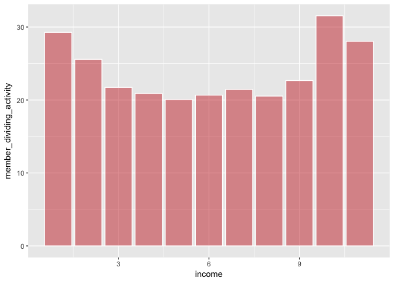

소득이 양극으로 갈수록(적을수록/많을수록) 1인당 지출 금액이 높아지는 양상을 보인다.

``` r
#소득에 따른 1인당 관광, 여행 및 숙박료(국내 및 국외)
data_total5 <- left_join(data_trip, data_member, by = "income")
divided_trip <- data_total5 %>% 
  mutate(member_dividing_trip = mean_trip / mean_member) %>%
  select(income, member_dividing_trip)
#소득에 따른 1인당 체육, 음악, 문화 활동비 지출(수강료, 동호회비 등 포함) 그래프
ggplot(data = divided_trip, aes(x = income, y = member_dividing_trip)) + geom_col(color="white", fill=rgb(0.7,0.7,0.2,0.5))
```

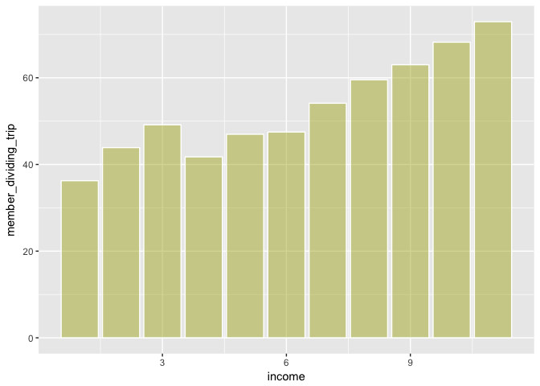

대체적으로 소득이 늘어남에 따라 1인당 관광, 여행 및 숙박료(국내 및 국외) 지출이 증가한다.

#### (3)-3. 경상소득별 1인당 여가 지출 비중 분석

가구원 수로 나눈(1인당 지출비) 여가별 지출 비중 그래프 출력하기

``` r
#모든 1인당 여가 지출 변수 합치기
data_total_divided <- left_join(divided_dvd, divided_movie, by = "income")
data_total_divided <- left_join(data_total_divided, divided_activity, by = "income")
data_total_divided <- left_join(data_total_divided, divided_trip, by = "income")
data_total_divided <- data_total_divided %>% 
  select(member_dividing_dvd, member_dividing_movie, member_dividing_activity, member_dividing_trip)
#경상소득별 1인당 여가 지출 비중 그래프 
rownames(data_total_divided)=c("below 100","100~199","200~299","300~399","400~499","500~599","600~699","700~799","800~899","900~999","above 1000")
barplot(t(data_total_divided), main = "Total Gragh(per person)", col=colors()[c(2,6,3,15)])
legend(0.1, 112, c("dvd", "movie", "activity", "trip"), fill = colors()[c(2,6,3,15)])
```

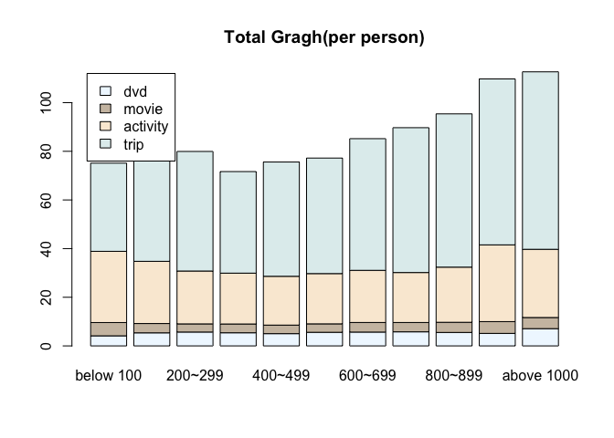

------------------------------------------------------------------------

추가 분석을 위해 변수명을 추가 분석 방향에 맞추어 보다 간편하게 바꾸었다. 또한 새로운 변수를 추가적으로 이용하기위해 이름을 바꿔주었다.

``` r
#변수명 수정
data <- rename(data, 
               consume = h09exp,           #연간 여행 관련 지출 총액
               dvd = dvd_spend,            #서적, 음반, DVD 등 구입 및 대여료
               movie = movie_spend,        #박물관, 공연, 영화 관람료
               activity = activity_spend,  #체육, 음악, 문화 활동비 지출(수강료, 동호회비 등 포함)
               triptot = trip_spend,       #관광, 여행 및 숙박료(국내 및 국외)
               tripoversea = h09cn007,     #해외 관광, 여행 및 숙박료
               tripdomestic = h09cn010,    #국내 관광, 여행 및 숙박료
               edu = w09edu01,             #가구주의 최종 교육 기관
               edugraduation = w09grd01,   #가구주의 최종 교육 기관 졸업 여부
               job = w09job01)             #직업 
```

``` r
#사용할 데이터만 할당
data <- data %>% 
  select(consume
         ,dvd
         ,movie
         ,activity
         ,triptot
         ,tripoversea
         ,tripdomestic
         ,edu
         ,edugraduation
         ,job)
str(data)
```

    ## 'data.frame':    4832 obs. of  10 variables:
    ##  $ consume      : num  4595 1242 503 1610 2413 ...
    ##  $ dvd          : num  NA NA NA 20 NA NA NA NA NA NA ...
    ##  $ movie        : num  NA NA NA NA NA NA NA NA NA NA ...
    ##  $ activity     : num  NA NA NA NA NA NA NA NA NA NA ...
    ##  $ triptot      : int  130 NA NA NA 300 NA 50 NA 30 300 ...
    ##  $ tripoversea  : int  130 NA NA NA NA NA 50 NA 30 300 ...
    ##  $ tripdomestic : int  NA NA NA NA 300 NA NA NA NA NA ...
    ##  $ edu          : int  5 4 2 6 4 2 6 2 NA NA ...
    ##  $ edugraduation: int  2 2 4 4 2 2 2 2 NA NA ...
    ##  $ job          : int  3 9 9 9 9 13 13 9 NA NA ...

추가 분석부터는 조금 더 세부적인 분석을 위해 여가 항목 중 `관광, 여행 및 숙박료(국내 및 국외)` 변수 대신 `국내 관광, 여행 및 숙박료`와 `해외 관광, 여행 및 숙박료` 두 항목으로 나누어 살펴보겠다. \#\#\# 해외 관광, 여행 및 숙박료 \#\#\#\# '해외 관광, 여행 및 숙박료' 변수 검토 및 전처리

``` r
#응답값 확인
table(data$tripoversea)
```

    ## 
    ##   -9    1    2    3    4    5    6    7   10   15   16   20   21   23   24 
    ##    1    1    3    1    1   11    4    1   46   10    1   90    1    1    1 
    ##   25   28   30   35   40   45   50   55   58   60   65   70   78   80   85 
    ##    8    2  183    7   65    1  325    2    1   71    1   56    1   73    1 
    ##   90  100  101  105  120  130  140  150  160  170  175  180  185  190  200 
    ##    4  482    1    2   58    8    5  168    5    4    1   10    1    1  224 
    ##  220  230  240  250  260  280  300  315  320  350  360  400  430  450  500 
    ##    1    1    3   31    1    1  108    1    3    8    2   18    1    5   18 
    ##  550  600  700  800  900 1000 1230 3000 
    ##    1    6    3    2    1    4    1    1

``` r
#존재할 수 없는 값(이상치)-무응답 값(-9로 표기)을 0으로 처리
data$tripoversea <- ifelse(data$tripoversea == -9, 0, data$tripoversea)
#결측치 개수 확인
table(is.na(data$tripoversea))
```

    ## 
    ## FALSE  TRUE 
    ##  2165  2667

``` r
#이상치 제거
boxplot(data$tripoversea)$stats
```

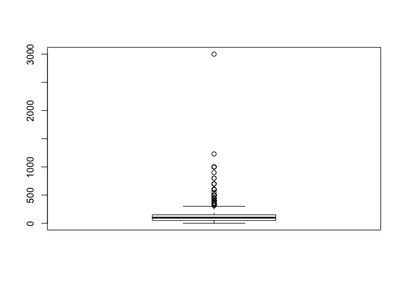

    ##      [,1]
    ## [1,]    0
    ## [2,]   50
    ## [3,]  100
    ## [4,]  150
    ## [5,]  300

``` r
data$tripoversea <- ifelse(data$tripoversea < 0 | data$tripoversea > 300, NA, data$tripoversea)
```

#### 해외 관광, 여행 및 숙박료의 평균, 최솟값, 중앙값, 최댓값 구하기

``` r
summary(data$tripoversea)
```

    ##    Min. 1st Qu.  Median    Mean 3rd Qu.    Max.    NA's 
    ##     0.0    50.0   100.0   102.9   150.0   300.0    2742

평균은 102.9만 원, 최솟값은 0만 원, 중앙값은 평균보다 작은 100만 원, 최댓값은 300만 원이다.

### 국내 관광, 여행 및 숙박료

#### '국내 관광, 여행 및 숙박료' 변수 검토 및 전처리

``` r
#존재할 수 없는 값(이상치)-무응답 값(-9로 표기)을 0으로 처리
data$tripdomestic <- ifelse(data$tripdomestic == -9, 0, data$tripdomestic)
#결측치 개수 확인
table(is.na(data$tripdomestic))
```

    ## 
    ## FALSE  TRUE 
    ##   738  4094

``` r
#이상치 제거
boxplot(data$tripdomestic)$stats
```

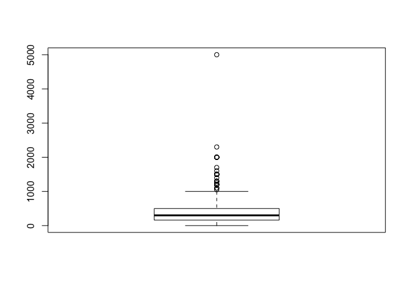

    ##      [,1]
    ## [1,]    0
    ## [2,]  160
    ## [3,]  300
    ## [4,]  500
    ## [5,] 1000

``` r
data$tripdomestic <- ifelse(data$tripdomestic < 0 | data$tripdomestic > 1000, NA, data$tripdomestic)
```

#### 국내 관광, 여행 및 숙박료의 평균, 최솟값, 중앙값, 최댓값 구하기

``` r
summary(data$tripdomestic)
```

    ##    Min. 1st Qu.  Median    Mean 3rd Qu.    Max.    NA's 
    ##     0.0   150.0   300.0   341.3   500.0  1000.0    4142

평균은 341.8만 원, 최솟값은 1만 원, 중앙값은 평균보다 작은 300만 원, 최댓값은 1000만 원이다.

``` r
data <- data %>% filter(!is.na(consume))
```

여가/여행비는 값이 0인 관측치가 존재하더라도 논리적으로는 문제가 없지만. 총소비 지출이 결측치 또는 0인 경우 논리적으로 문제가 있으므로 총소비 지출 변수에서 결측치가 존재하는 관측치는 제외한다.

### 3) 학력별 여가 지출 차이

#### (1) 학력 변수 검토 및 전처리

학력기준은 '가구주'입니다.

``` r
#졸업 여부 변수 항목 확인
table(data$edugraduation)
```

    ## 
    ##    1    2    3    4 
    ##   21 3433   12  123

졸업 여부 변수 확인 결과 2(졸업)이 나머지 1(재학), 3(수료), 4(중퇴)보다 현저히 많다. 수료는 졸업과 같다고 간주하고 졸업, 수료를 제외한 나머지 항목을 필터링하여 학력별 졸업자만 대상으로 분석할 것이다.

``` r
dataedu <- data %>% 
  filter(edugraduation %in% c(2, 3))
```

``` r
#최종 교육 기관 결측치 확인
table(is.na(dataedu$edu))
```

    ## 
    ## FALSE 
    ##  3445

``` r
#졸업여부 변수 결측치 확인 
table(is.na(dataedu$edugraduation)) 
```

    ## 
    ## FALSE 
    ##  3445

``` r
#학력(최종 교육 기관) 분포 확인 
table(dataedu$edu)
```

    ## 
    ##    2    3    4    5    6    7    8 
    ##  397  374 1169  331 1013  127   34

2 = 초졸, 3 = 중졸, 4 = 고졸, 5 = 2년제 대졸, 6 = 4년제 대졸, 7 = 석사 졸, 8 = 박사 졸

``` r
edudf <- data.frame(edu = c(2, 3, 4, 5, 6, 7, 8),
                    eduname = c('초졸', '중졸', '고졸', '2년제대졸', '4년제대졸', '대학원졸', '대학원졸'))
dataedu <- left_join(dataedu, edudf, by = 'edu')
```

`학력 변수(edu)` 내의 값을 기준으로 `학력명 변수(eduname)`를 생성하였다. `박사 졸`의 수가 적었기 때문에 `석사  졸`과 `박사 졸`을 `대학원 졸`이라는 값으로 통합하여 할당했다.

``` r
#학력별 분포
table(dataedu$eduname)
```

    ## 
    ## 2<U+B144><U+C81C><U+B300><U+C878> 4<U+B144><U+C81C><U+B300><U+C878> 
    ##                               331                              1013 
    ##                  <U+ACE0><U+C878>  <U+B300><U+D559><U+C6D0><U+C878> 
    ##                              1169                               161 
    ##                  <U+C911><U+C878>                  <U+CD08><U+C878> 
    ##                               374                               397

#### (2) 학력에 따른 여가 종류별 지출 차이

학력별로 비교하기 위해 여가 종류마다 학력별 평균값 변수를 생성했다.

``` r
#학력별 서적, 음반, DVD 등 구입 및 대여료
dataedu_dvd <- dataedu %>% 
  select(eduname, dvd) %>% 
  group_by(eduname) %>% 
  summarise(mean_expenditure = mean(dvd, na.rm = T)) %>%
  mutate(category = 'mean_dvd')
dataedu_dvd
```

    ## # A tibble: 6 x 3
    ##   eduname                           mean_expenditure category
    ##   <fct>                                        <dbl> <chr>   
    ## 1 2<U+B144><U+C81C><U+B300><U+C878>             18.4 mean_dvd
    ## 2 4<U+B144><U+C81C><U+B300><U+C878>             19.6 mean_dvd
    ## 3 <U+ACE0><U+C878>                              16.8 mean_dvd
    ## 4 <U+B300><U+D559><U+C6D0><U+C878>              20.0 mean_dvd
    ## 5 <U+C911><U+C878>                              14.3 mean_dvd
    ## 6 <U+CD08><U+C878>                              12.6 mean_dvd

``` r
#학력별 박물관, 공연, 영화 관람료
dataedu_movie<- dataedu %>% 
  select(eduname, movie) %>% 
  group_by(eduname) %>% 
  summarise(mean_expenditure = mean(movie, na.rm = T)) %>% 
  mutate(category = 'mean_movie')
dataedu_movie
```

    ## # A tibble: 6 x 3
    ##   eduname                           mean_expenditure category  
    ##   <fct>                                        <dbl> <chr>     
    ## 1 2<U+B144><U+C81C><U+B300><U+C878>            11.9  mean_movie
    ## 2 4<U+B144><U+C81C><U+B300><U+C878>            12.3  mean_movie
    ## 3 <U+ACE0><U+C878>                             10.4  mean_movie
    ## 4 <U+B300><U+D559><U+C6D0><U+C878>             14.4  mean_movie
    ## 5 <U+C911><U+C878>                              9.66 mean_movie
    ## 6 <U+CD08><U+C878>                              8.82 mean_movie

``` r
#학력별 체육, 음악, 문화 활동비 지출(수강료, 동호회비 등 포함)
dataedu_activity<- dataedu %>% 
  select(eduname, activity) %>% 
  group_by(eduname) %>% 
  summarise(mean_expenditure = mean(activity, na.rm = T)) %>% 
  mutate(category = 'mean_activity')
dataedu_activity
```

    ## # A tibble: 6 x 3
    ##   eduname                           mean_expenditure category     
    ##   <fct>                                        <dbl> <chr>        
    ## 1 2<U+B144><U+C81C><U+B300><U+C878>             59.0 mean_activity
    ## 2 4<U+B144><U+C81C><U+B300><U+C878>             78.0 mean_activity
    ## 3 <U+ACE0><U+C878>                              56.5 mean_activity
    ## 4 <U+B300><U+D559><U+C6D0><U+C878>              90.7 mean_activity
    ## 5 <U+C911><U+C878>                              56.1 mean_activity
    ## 6 <U+CD08><U+C878>                              37.8 mean_activity

``` r
#학력별 해외 관광, 여행 및 숙박료
dataedu_tripoversea<- dataedu %>% 
  select(eduname, tripoversea) %>% 
  group_by(eduname) %>% 
  summarise(mean_expenditure = mean(tripoversea, na.rm = T)) %>% 
  mutate(category = 'mean_tripoversea')
dataedu_tripoversea
```

    ## # A tibble: 6 x 3
    ##   eduname                           mean_expenditure category        
    ##   <fct>                                        <dbl> <chr>           
    ## 1 2<U+B144><U+C81C><U+B300><U+C878>            109.  mean_tripoversea
    ## 2 4<U+B144><U+C81C><U+B300><U+C878>            115.  mean_tripoversea
    ## 3 <U+ACE0><U+C878>                              91.1 mean_tripoversea
    ## 4 <U+B300><U+D559><U+C6D0><U+C878>             121.  mean_tripoversea
    ## 5 <U+C911><U+C878>                              66.3 mean_tripoversea
    ## 6 <U+CD08><U+C878>                              54.5 mean_tripoversea

``` r
#학력별 관광, 여행 및 숙박료
dataedu_tripdomestic<- dataedu %>% 
  select(eduname, tripdomestic) %>% 
  group_by(eduname) %>% 
  summarise(mean_expenditure = mean(tripdomestic, na.rm = T)) %>% 
  mutate(category = 'mean_tripdomestic')
dataedu_tripdomestic
```

    ## # A tibble: 6 x 3
    ##   eduname                           mean_expenditure category         
    ##   <fct>                                        <dbl> <chr>            
    ## 1 2<U+B144><U+C81C><U+B300><U+C878>             300. mean_tripdomestic
    ## 2 4<U+B144><U+C81C><U+B300><U+C878>             362. mean_tripdomestic
    ## 3 <U+ACE0><U+C878>                              296. mean_tripdomestic
    ## 4 <U+B300><U+D559><U+C6D0><U+C878>              396. mean_tripdomestic
    ## 5 <U+C911><U+C878>                              312. mean_tripdomestic
    ## 6 <U+CD08><U+C878>                              226. mean_tripdomestic

#### (3) 학력에 따른 여가 지출 차이

학력별로 모든 여가/여행비를 비교하기 위해 데이터 구조를 바꾸어준다.

``` r
dataedu3 <- bind_rows(dataedu_dvd, dataedu_movie, dataedu_activity, dataedu_tripoversea, dataedu_tripdomestic)
head(dataedu3)
```

    ## # A tibble: 6 x 3
    ##   eduname                           mean_expenditure category
    ##   <fct>                                        <dbl> <chr>   
    ## 1 2<U+B144><U+C81C><U+B300><U+C878>             18.4 mean_dvd
    ## 2 4<U+B144><U+C81C><U+B300><U+C878>             19.6 mean_dvd
    ## 3 <U+ACE0><U+C878>                              16.8 mean_dvd
    ## 4 <U+B300><U+D559><U+C6D0><U+C878>              20.0 mean_dvd
    ## 5 <U+C911><U+C878>                              14.3 mean_dvd
    ## 6 <U+CD08><U+C878>                              12.6 mean_dvd

``` r
#학력별 여가/여행비 지출 금액
ggplot(data = dataedu3, aes(x = reorder(eduname, mean_expenditure), y = mean_expenditure, fill = category)) +        geom_col() +
  ggtitle('학력별 여가/여행비 지출 금액')
```

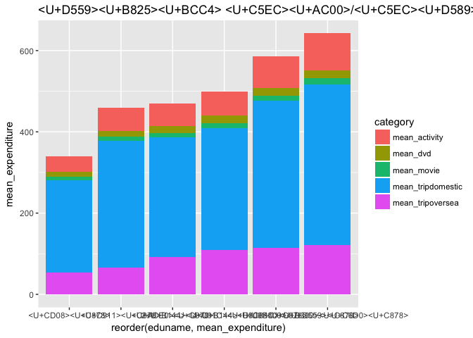 학력이 높아질수록 총 여가/여행비 또한 증가하고 있다.

``` r
#학력별 여가/여행비 지출 비중
ggplot(data = dataedu3, aes(x = reorder(eduname, mean_expenditure), y = mean_expenditure, fill = category)) + geom_col(position='fill') +
  ggtitle('학력별 여가/여행비 지출 비중')
```

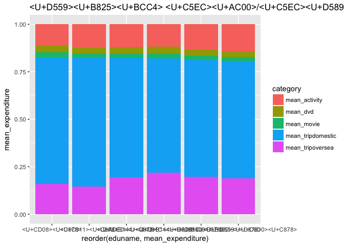 `서적, 음반, DVD 등 구입 및 대여료`, 박물관, 공연, 영화 관람료`,`체육, 음악, 문화 활동비 지출(수강료, 동호회비 등 포함)`는 학력이 높아질수록 점진적으로 증가하는 추세이다. 중졸에서 2년제 대졸까지`국내 관광, 여행 및 숙박료`의 비중이 감소하고`해외 관광, 여행 및 숙박료\`의 비중이 증가하다 4년제 대졸부터 그 반대의 모습을 보인다.

#### (4) 학력별 총 지출 대비 여가/여행비 지출 평균

종속변수인 여가/여행 지출비 항목의 결측치는 밀도 그래프 표현을 위해 0으로 대체한다.

``` r
dataedu$dvd <- ifelse(is.na(dataedu$dvd), 0, dataedu$dvd)
dataedu$movie <- ifelse(is.na(dataedu$movie), 0, dataedu$movie)
dataedu$activity <- ifelse(is.na(dataedu$activity), 0, dataedu$activity)
dataedu$triptot <- ifelse(is.na(dataedu$triptot), 0, dataedu$triptot)
```

``` r
#총여가비 변수 생성
dataedu <- dataedu %>% mutate(leisuretot = dvd + movie + activity)
head(dataedu)
```

    ##    consume dvd movie activity triptot tripoversea tripdomestic edu
    ## 1 4594.703   0     0        0     130         130           NA   5
    ## 2 1242.400   0     0        0       0          NA           NA   4
    ## 3 2413.400   0     0        0     300          NA          300   4
    ## 4  548.200   0     0        0       0          NA           NA   2
    ## 5 2245.316   0     0        0      50          50           NA   6
    ## 6 3075.000   0     0        0       0          NA           NA   2
    ##   edugraduation job                           eduname leisuretot
    ## 1             2   3 2<U+B144><U+C81C><U+B300><U+C878>          0
    ## 2             2   9                  <U+ACE0><U+C878>          0
    ## 3             2   9                  <U+ACE0><U+C878>          0
    ## 4             2  13                  <U+CD08><U+C878>          0
    ## 5             2  13 4<U+B144><U+C81C><U+B300><U+C878>          0
    ## 6             2   9                  <U+CD08><U+C878>          0

``` r
#총 지출 대비 여가/여행비 지출 평균변수 생성
dataedu <- dataedu %>% mutate(lt_consume_ratio = (leisuretot + triptot) / consume * 100)
```

``` r
#학력별 총 지출 대비 여가/여행비 지출 평균값 확인
lt_consume_ratio_mean <- dataedu %>%
  group_by(eduname) %>% 
  summarise(lt_consume_ratio_mean = mean(lt_consume_ratio)) %>% 
  arrange(lt_consume_ratio_mean)
lt_consume_ratio_mean
```

    ## # A tibble: 6 x 2
    ##   eduname                           lt_consume_ratio_mean
    ##   <fct>                                             <dbl>
    ## 1 <U+CD08><U+C878>                                  0.911
    ## 2 <U+C911><U+C878>                                  1.29 
    ## 3 <U+ACE0><U+C878>                                  1.75 
    ## 4 2<U+B144><U+C81C><U+B300><U+C878>                 2.73 
    ## 5 4<U+B144><U+C81C><U+B300><U+C878>                 2.89 
    ## 6 <U+B300><U+D559><U+C6D0><U+C878>                  2.98

``` r
#학력별 총지출대비 여가/여행비 지출 비중 그래프
library(ggridges)
ggplot(dataedu, aes(x = lt_consume_ratio, y = reorder(eduname, -lt_consume_ratio), fill = eduname)) +
  geom_density_ridges() +
  theme_ridges() + 
  theme(legend.position = "none") +
  ggtitle('학력별 총지출대비 여가/여행비 지출 비중 분포')
```

    ## Picking joint bandwidth of 0.61


여가/여행비 지출 비중을 정렬 기준으로 설정했는데, 이는 위의 막대그래프와 동일한 순서(여가/여행비 지출액)로 정렬된 것으로 나타났다. 학력별 총 지출 대비 여가/여행비 지출 비중 분포 그래프 상에서 저학력일수록 분포가 평균값에 몰려있고 분산이 적은 것을 확인할 수 있었다. 또한 대체로 고학력일수록 평균값이 더 큰 것으로 보인다.

``` r
#위의 그래프에서 확인한 것 처럼 학력별 총지출대비 여가/여행비 지출 비중의 차이가 유의한지 검정하기 위해 분산분석
aov1  <- aov(lt_consume_ratio ~ eduname, data = dataedu)
summary(aov1)
```

    ##               Df Sum Sq Mean Sq F value Pr(>F)    
    ## eduname        5   1833   366.6   40.74 <2e-16 ***
    ## Residuals   3439  30944     9.0                   
    ## ---
    ## Signif. codes:  0 '***' 0.001 '**' 0.01 '*' 0.05 '.' 0.1 ' ' 1

F값이 48.78로 자유도가 5인 F분포에서 유의확률(P-value)이 0.001이하의 매우 작은 값이 나왔으므로 유의수준 0.01 하에서 귀무가설을 기각할 수 있다. 학력간의 여가/여행비 지출 비중의 차이가 유의하다고 주장가능하다. 따라서 학력이 높아질수록 여가/여행비 지출 비중이 늘어난다고 할 수 있다.

### 4) 직종별 여가/여행비 지출분석

#### (1)변수 검토 및 전처리

``` r
#결측치 확인 및 제거
table(is.na(data$job))
```

    ## 
    ## FALSE  TRUE 
    ##  3743   297

``` r
datajob <- data %>%
  filter(!is.na(job))
```

``` r
#직종분포 확인 (1 = 관리직, 2 = 전문직, 3 = 서비스직, 4 = 사무직, 5 = 판매직, 6 = 농림어업, 7 = 기능직, 8 = 기계조작직, 9 = 단순노무직, 10 = 직업군인, 11 = 기타취업, 12 = 전업주부, 13 = 무직, 14 = 학생)
table(datajob$job)
```

    ## 
    ##   1   2   3   4   5   6   7   8   9  10  11  12  13  14 
    ## 192 200 618 361 261 251 438 224 292  16   4 188 697   1

10, 11, 14 항목은 관측치가 충분치 않다고 판단하여 분석에서 제외했다.

``` r
jobdf <- data.frame(job = c(1, 2, 3, 4, 5, 6, 7, 8, 9, 12, 13),
                    jobname = c('관리직','전문직','서비스직','사무직','판매직','농림어업','기능직','기계조작직','단순노무직','전업주부','무직'))
datajob <- left_join(datajob, jobdf, by = 'job')
datajob <- datajob %>% filter(jobname %in% c('관리직','전문직','서비스직', '사무직','판매직','농림어업','기능직','기계조작직','단순노무직','전업주부','무직'))
head(datajob)
```

    ##    consume dvd movie activity triptot tripoversea tripdomestic edu
    ## 1 4594.703  NA    NA       NA     130         130           NA   5
    ## 2 1242.400  NA    NA       NA      NA          NA           NA   4
    ## 3  503.400  NA    NA       NA      NA          NA           NA   2
    ## 4 1610.000  20    NA       NA      NA          NA           NA   6
    ## 5 2413.400  NA    NA       NA     300          NA          300   4
    ## 6  548.200  NA    NA       NA      NA          NA           NA   2
    ##   edugraduation job                                  jobname
    ## 1             2   3         <U+C11C><U+BE44><U+C2A4><U+C9C1>
    ## 2             2   9 <U+B2E8><U+C21C><U+B178><U+BB34><U+C9C1>
    ## 3             4   9 <U+B2E8><U+C21C><U+B178><U+BB34><U+C9C1>
    ## 4             4   9 <U+B2E8><U+C21C><U+B178><U+BB34><U+C9C1>
    ## 5             2   9 <U+B2E8><U+C21C><U+B178><U+BB34><U+C9C1>
    ## 6             2  13                         <U+BB34><U+C9C1>

``` r
#직종별 분포
table(datajob$jobname)
```

    ## 
    ##                 <U+AD00><U+B9AC><U+C9C1> 
    ##                                      192 
    ## <U+AE30><U+ACC4><U+C870><U+C791><U+C9C1> 
    ##                                      224 
    ##                 <U+AE30><U+B2A5><U+C9C1> 
    ##                                      438 
    ##         <U+B18D><U+B9BC><U+C5B4><U+C5C5> 
    ##                                      251 
    ## <U+B2E8><U+C21C><U+B178><U+BB34><U+C9C1> 
    ##                                      292 
    ##                         <U+BB34><U+C9C1> 
    ##                                      697 
    ##                 <U+C0AC><U+BB34><U+C9C1> 
    ##                                      361 
    ##         <U+C11C><U+BE44><U+C2A4><U+C9C1> 
    ##                                      618 
    ##                 <U+C804><U+BB38><U+C9C1> 
    ##                                      200 
    ##         <U+C804><U+C5C5><U+C8FC><U+BD80> 
    ##                                      188 
    ##                 <U+D310><U+B9E4><U+C9C1> 
    ##                                      261

#### (2)직종에 따른 여가 종류별 지출 차이

직종별로 비교하기 위해 직종으로 그룹을 만들고 직종 그룹당 여가/여행비 평균값 변수를 생성

``` r
#직종별 서적, 음반, DVD 등 구입 및 대여료
datajob_dvd <- datajob %>% 
  select(jobname, dvd) %>% 
  group_by(jobname) %>% 
  summarise(mean_expenditure = mean(dvd, na.rm = T)) %>%
  mutate(category = 'mean_dvd')
datajob_dvd
```

    ## # A tibble: 11 x 3
    ##    jobname                                  mean_expenditure category
    ##    <fct>                                               <dbl> <chr>   
    ##  1 <U+AD00><U+B9AC><U+C9C1>                             22.8 mean_dvd
    ##  2 <U+AE30><U+ACC4><U+C870><U+C791><U+C9C1>             17.2 mean_dvd
    ##  3 <U+AE30><U+B2A5><U+C9C1>                             16.6 mean_dvd
    ##  4 <U+B18D><U+B9BC><U+C5B4><U+C5C5>                     19.5 mean_dvd
    ##  5 <U+B2E8><U+C21C><U+B178><U+BB34><U+C9C1>             13.7 mean_dvd
    ##  6 <U+BB34><U+C9C1>                                     13.5 mean_dvd
    ##  7 <U+C0AC><U+BB34><U+C9C1>                             17.3 mean_dvd
    ##  8 <U+C11C><U+BE44><U+C2A4><U+C9C1>                     19.1 mean_dvd
    ##  9 <U+C804><U+BB38><U+C9C1>                             20.7 mean_dvd
    ## 10 <U+C804><U+C5C5><U+C8FC><U+BD80>                     17.8 mean_dvd
    ## 11 <U+D310><U+B9E4><U+C9C1>                             17.0 mean_dvd

``` r
#직종별 박물관, 공연, 영화 관람료
datajob_movie <- datajob %>% 
  select(jobname, movie) %>% 
  group_by(jobname) %>% 
  summarise(mean_expenditure = mean(movie, na.rm = T)) %>% 
  mutate(category = 'mean_movie')
datajob_movie
```

    ## # A tibble: 11 x 3
    ##    jobname                                  mean_expenditure category  
    ##    <fct>                                               <dbl> <chr>     
    ##  1 <U+AD00><U+B9AC><U+C9C1>                            15.1  mean_movie
    ##  2 <U+AE30><U+ACC4><U+C870><U+C791><U+C9C1>            11.8  mean_movie
    ##  3 <U+AE30><U+B2A5><U+C9C1>                            11.0  mean_movie
    ##  4 <U+B18D><U+B9BC><U+C5B4><U+C5C5>                     8.50 mean_movie
    ##  5 <U+B2E8><U+C21C><U+B178><U+BB34><U+C9C1>             8.72 mean_movie
    ##  6 <U+BB34><U+C9C1>                                     8.82 mean_movie
    ##  7 <U+C0AC><U+BB34><U+C9C1>                            10.6  mean_movie
    ##  8 <U+C11C><U+BE44><U+C2A4><U+C9C1>                    12.3  mean_movie
    ##  9 <U+C804><U+BB38><U+C9C1>                            13.9  mean_movie
    ## 10 <U+C804><U+C5C5><U+C8FC><U+BD80>                     9.70 mean_movie
    ## 11 <U+D310><U+B9E4><U+C9C1>                            10.8  mean_movie

``` r
#직종별 체육, 음악, 문화 활동비 지출(수강료, 동호회비 등 포함)
datajob_activity<- datajob %>% 
  select(jobname, activity) %>% 
  group_by(jobname) %>% 
  summarise(mean_expenditure = mean(activity, na.rm = T)) %>% 
  mutate(category = 'mean_activity')
datajob_activity
```

    ## # A tibble: 11 x 3
    ##    jobname                                  mean_expenditure category     
    ##    <fct>                                               <dbl> <chr>        
    ##  1 <U+AD00><U+B9AC><U+C9C1>                             91.5 mean_activity
    ##  2 <U+AE30><U+ACC4><U+C870><U+C791><U+C9C1>             48.5 mean_activity
    ##  3 <U+AE30><U+B2A5><U+C9C1>                             53.7 mean_activity
    ##  4 <U+B18D><U+B9BC><U+C5B4><U+C5C5>                     61.5 mean_activity
    ##  5 <U+B2E8><U+C21C><U+B178><U+BB34><U+C9C1>             39.2 mean_activity
    ##  6 <U+BB34><U+C9C1>                                     61.2 mean_activity
    ##  7 <U+C0AC><U+BB34><U+C9C1>                             61.3 mean_activity
    ##  8 <U+C11C><U+BE44><U+C2A4><U+C9C1>                     75.7 mean_activity
    ##  9 <U+C804><U+BB38><U+C9C1>                             86.1 mean_activity
    ## 10 <U+C804><U+C5C5><U+C8FC><U+BD80>                     32.8 mean_activity
    ## 11 <U+D310><U+B9E4><U+C9C1>                             71.5 mean_activity

``` r
#직종별 해외 관광, 여행 및 숙박료
datajob_tripoversea<- datajob %>% 
  select(jobname, tripoversea) %>% 
  group_by(jobname) %>% 
  summarise(mean_expenditure = mean(tripoversea, na.rm = T)) %>% 
  mutate(category = 'mean_tripoversea')
datajob_tripoversea
```

    ## # A tibble: 11 x 3
    ##    jobname                                  mean_expenditure category     
    ##    <fct>                                               <dbl> <chr>        
    ##  1 <U+AD00><U+B9AC><U+C9C1>                            130.  mean_tripove~
    ##  2 <U+AE30><U+ACC4><U+C870><U+C791><U+C9C1>             85.8 mean_tripove~
    ##  3 <U+AE30><U+B2A5><U+C9C1>                             87.0 mean_tripove~
    ##  4 <U+B18D><U+B9BC><U+C5B4><U+C5C5>                     69.7 mean_tripove~
    ##  5 <U+B2E8><U+C21C><U+B178><U+BB34><U+C9C1>             70.6 mean_tripove~
    ##  6 <U+BB34><U+C9C1>                                     72.9 mean_tripove~
    ##  7 <U+C0AC><U+BB34><U+C9C1>                             88.1 mean_tripove~
    ##  8 <U+C11C><U+BE44><U+C2A4><U+C9C1>                    121.  mean_tripove~
    ##  9 <U+C804><U+BB38><U+C9C1>                            129.  mean_tripove~
    ## 10 <U+C804><U+C5C5><U+C8FC><U+BD80>                     91.8 mean_tripove~
    ## 11 <U+D310><U+B9E4><U+C9C1>                             97.4 mean_tripove~

``` r
#직종별 국내 관광, 여행 및 숙박료
datajob_tripdomestic<- datajob %>% 
  select(jobname, tripdomestic) %>% 
  group_by(jobname) %>% 
  summarise(mean_expenditure = mean(tripdomestic, na.rm = T)) %>% 
  mutate(category = 'mean_tripdomestic')
datajob_tripdomestic
```

    ## # A tibble: 11 x 3
    ##    jobname                                  mean_expenditure category     
    ##    <fct>                                               <dbl> <chr>        
    ##  1 <U+AD00><U+B9AC><U+C9C1>                             423. mean_tripdom~
    ##  2 <U+AE30><U+ACC4><U+C870><U+C791><U+C9C1>             302. mean_tripdom~
    ##  3 <U+AE30><U+B2A5><U+C9C1>                             335. mean_tripdom~
    ##  4 <U+B18D><U+B9BC><U+C5B4><U+C5C5>                     227. mean_tripdom~
    ##  5 <U+B2E8><U+C21C><U+B178><U+BB34><U+C9C1>             298. mean_tripdom~
    ##  6 <U+BB34><U+C9C1>                                     283. mean_tripdom~
    ##  7 <U+C0AC><U+BB34><U+C9C1>                             241. mean_tripdom~
    ##  8 <U+C11C><U+BE44><U+C2A4><U+C9C1>                     347. mean_tripdom~
    ##  9 <U+C804><U+BB38><U+C9C1>                             378. mean_tripdom~
    ## 10 <U+C804><U+C5C5><U+C8FC><U+BD80>                     133. mean_tripdom~
    ## 11 <U+D310><U+B9E4><U+C9C1>                             385. mean_tripdom~

직종별로 모든 여가/여행비를 비교하기 위해 데이터 구조 변형

``` r
datajob3 <- bind_rows(datajob_dvd, datajob_movie, datajob_activity, datajob_tripoversea, datajob_tripdomestic)
head(datajob3)
```

    ## # A tibble: 6 x 3
    ##   jobname                                  mean_expenditure category
    ##   <fct>                                               <dbl> <chr>   
    ## 1 <U+AD00><U+B9AC><U+C9C1>                             22.8 mean_dvd
    ## 2 <U+AE30><U+ACC4><U+C870><U+C791><U+C9C1>             17.2 mean_dvd
    ## 3 <U+AE30><U+B2A5><U+C9C1>                             16.6 mean_dvd
    ## 4 <U+B18D><U+B9BC><U+C5B4><U+C5C5>                     19.5 mean_dvd
    ## 5 <U+B2E8><U+C21C><U+B178><U+BB34><U+C9C1>             13.7 mean_dvd
    ## 6 <U+BB34><U+C9C1>                                     13.5 mean_dvd

#### (3)직종에 따른 여가 지출 차이

``` r
#직종별 여가/여행비 지출 금액
ggplot(data = datajob3, aes(x = reorder(jobname, mean_expenditure), y = mean_expenditure, fill = category)) +        geom_col() +
  coord_flip()+
  ggtitle('직종별 여가/여행비 지출 금액')
```


대체로 직종이 고소득일수록 총 여가/여행비가 증가하고 있다.

#### (4)직종별 여가 지출 비중 분석

``` r
#직종별 여가/여행비 지출 비중
ggplot(data = datajob3, aes(x = reorder(jobname, mean_expenditure), y = mean_expenditure, fill = category)) + geom_col(position='fill') +
  coord_flip()+
  ggtitle('직종별 여가/여행비 지출 비중')
```


#### 직종별 총 지출 대비 여가/여행비 지출의 분포

종속변수인 여가/여행 지출비 항목의 결측치는 밀도 그래프 표현을 0으로 대체한다.

``` r
datajob$dvd <- ifelse(is.na(datajob$dvd), 0, datajob$dvd)
datajob$movie <- ifelse(is.na(datajob$movie), 0, datajob$movie)
datajob$activity <- ifelse(is.na(datajob$activity), 0, datajob$activity)
datajob$triptot <- ifelse(is.na(datajob$triptot), 0, datajob$triptot)

#총여가비 변수 생성
datajob <- datajob %>% mutate(leisuretot = dvd + movie + activity)


#총 지출 대비 여가/여행비 지출 평균변수 생성
datajob <- datajob %>% mutate(lt_consume_ratio = (leisuretot + triptot) / consume * 100)
```

``` r
#직종별 총 지출 대비 여가/여행비 지출 평균값 확인
lt_consume_ratio_mean <- datajob %>%
  group_by(jobname) %>% 
  summarise(lt_consume_ratio_mean = mean(lt_consume_ratio)) %>% 
  arrange(lt_consume_ratio_mean)
lt_consume_ratio_mean
```

    ## # A tibble: 11 x 2
    ##    jobname                                  lt_consume_ratio_mean
    ##    <fct>                                                    <dbl>
    ##  1 <U+C804><U+C5C5><U+C8FC><U+BD80>                         0.985
    ##  2 <U+BB34><U+C9C1>                                         1.31 
    ##  3 <U+B2E8><U+C21C><U+B178><U+BB34><U+C9C1>                 1.31 
    ##  4 <U+B18D><U+B9BC><U+C5B4><U+C5C5>                         1.52 
    ##  5 <U+AE30><U+ACC4><U+C870><U+C791><U+C9C1>                 1.67 
    ##  6 <U+C0AC><U+BB34><U+C9C1>                                 1.82 
    ##  7 <U+AE30><U+B2A5><U+C9C1>                                 1.94 
    ##  8 <U+D310><U+B9E4><U+C9C1>                                 2.09 
    ##  9 <U+AD00><U+B9AC><U+C9C1>                                 2.59 
    ## 10 <U+C11C><U+BE44><U+C2A4><U+C9C1>                         3.13 
    ## 11 <U+C804><U+BB38><U+C9C1>                                 3.20

``` r
#직종별 총지출대비 여가/여행비 지출 비중 그래프
ggplot(datajob, aes(x = lt_consume_ratio , y = reorder(jobname, - lt_consume_ratio ), fill = jobname)) + geom_density_ridges() +
  theme_ridges() + 
  theme(legend.position = "none") +
  ggtitle('직종별 총지출대비 여가/여행비 지출 비중')
```

    ## Picking joint bandwidth of 0.507


직종의 경우도 학력과 마찬가지로 여가/여행비 지출 비중을 정렬 기준으로 설정했는데, 이는 위의 막대그래프와 대체로 동일한 순서(여가/여행비 지출액)로 정렬된 것으로 나타났다. 여가/여행비 지출액에서는 1위였던 관리직은 총 지출 대비 비중에서 3위로 하락했고, 2, 3위였던 전문직, 서비스직이 1, 2위로 1계단 씩 상승했다. 직종별 총 지출 대비 여가/여행비 지출 비중 분포 그래프 상에서 저소득 직종일수록 분포가 평균값에 몰려있고 분산이 적은 것을 확인할 수 있었다. 또한 대체로 고소득 직종일수록 평균값이 더 큰 것으로 보인다.

``` r
#위의 그래프에서 확인한 것 처럼 직종별 총지출대비 여가/여행비 지출 비중의 차이가 유의한지 검정하기 위해 분산분석
aov2  <- aov(lt_consume_ratio ~ jobname, data = datajob)
summary(aov2)
```

    ##               Df Sum Sq Mean Sq F value Pr(>F)    
    ## jobname       10   1907  190.66   22.14 <2e-16 ***
    ## Residuals   3711  31958    8.61                   
    ## ---
    ## Signif. codes:  0 '***' 0.001 '**' 0.01 '*' 0.05 '.' 0.1 ' ' 1

F 값이 22.14로 자유도가 10인 F 분포에서 유의 확률(P-value)이 0.001이하의 매우 작은 값이 나왔으므로 유의수준 0.01하에서 귀무가설을 기각할 수 있다. 여가/여행비 지출 비중의 차이가 유의하다고 주장할 수 있다. 따라서 고소득 직종일수록 여가/여행비 지출 비중이 늘어난다고 할 수 있다.

------------------------------------------------------------------------

Ⅲ. 논의
-------

### 1. 한계점

데이터 자체가 여가를 비롯한 가구의 생활 부분보다는 세금이나 재산 상황 등에 초점이 맞춰져 있어 재정 관련 분석에 적합했다고 할 수 있다. 때문에 여가에 관한 심층적인 분석을 하는데 한계가 있었는데, 가구의 지출 중 여가와 관련된 항목을 임의로 선정했으며 다양한 여가 항목을 포괄하지 못했다. 분석 과정에서는 이상치 처리 부분에서 무응답자와 지출하지 않았다고 대답한 관측치를 전부 누락시키고 평균을 구했는데, 0으로 대체했을 때보다 그룹 간 차이의 경향성이 덜 부각되게 나오는 결과를 낳았다.

### 2. 추후분석방향

학력과 직종이 여가에 미치는 영향을 분석하기에는 가구용 데이터보다는 가구 원용 데이터가 더 적합했을 것이라는 생각이 들었다. 만약 이 부분에서 가구 원용 데이터를 사용했다면 가구주뿐만 아니라 다양한 가구원의 학력, 직종을 이용할 수 있었을 것이다.
