Untitled
================

``` r
library("dplyr")
```

    ## 
    ## Attaching package: 'dplyr'

    ## The following objects are masked from 'package:stats':
    ## 
    ##     filter, lag

    ## The following objects are masked from 'package:base':
    ## 
    ##     intersect, setdiff, setequal, union

``` r
library("ggplot2")
data <- read.csv("NaSTaB09H.csv")
# h09ca001 = 경상소득
# h1-1. (1) h09ch001 / (2) h09ch002
# h1-2. (1) h09ch003 / (2) h09ch004
# h1-3. (1) h09ch005 / (2) h09ch006
# h1-6. (1) h09ch012 / (2) h09ch013
# n1-1. (1) h09cn001 / (2) h09cn002

# 1. 알아보기 쉽도록 변수명 바꾸기
data <- rename(data, income = h09ca001)
data <- rename(data, dvd_spend_yesno = h09ch001)
data <- rename(data, dvd_spend = h09ch002)
data <- rename(data, movie_spend_yesno = h09ch003)
data <- rename(data, movie_spend = h09ch004)
data <- rename(data, race_spend_yesno = h09ch005)
data <- rename(data, race_spend = h09ch006)
data <- rename(data, activity_spend_yesno = h09ch012)
data <- rename(data, activity_spend = h09ch013)
data <- rename(data, trip_spend_yesno = h09cn001)
data <- rename(data, trip_spend = h09cn002)
data <- rename(data, member_n = h09aa007)
data <- rename(data, member_income = h09aa008)


# 2-1. h1_1 '서적, 음반, DVD 등 구입 및 대여료' 문항 지출여부에 '예'라고 답한사람들의 평균 지출액 구하기

  #결측값 0으로 바꿔주기(-9 = 결측값)
data$dvd_spend <- ifelse(data$dvd_spend == -9, NA, data$dvd_spend)
  #결측치 몇개인지 알아보기(응답자 몇 가구인지 알아보기)
table(is.na(data$dvd_spend))
```

    ## 
    ## FALSE  TRUE 
    ##  1913  2919

``` r
  #이상치 제거하기
boxplot(data$dvd_spend)$stats
```

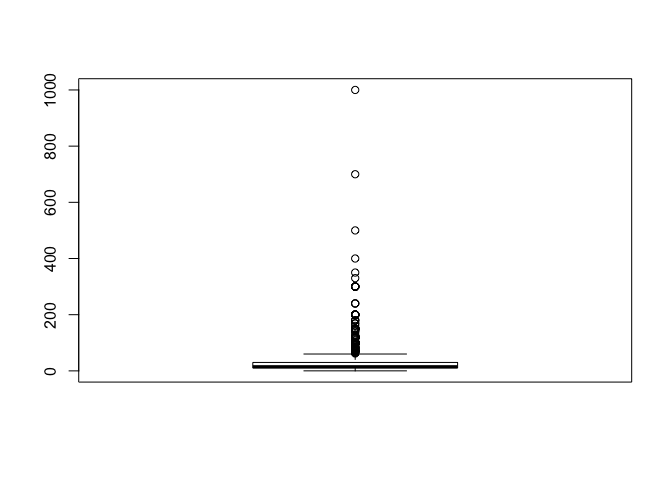

    ##      [,1]
    ## [1,]  0.1
    ## [2,] 10.0
    ## [3,] 15.0
    ## [4,] 30.0
    ## [5,] 60.0

``` r
data$dvd_spend <- ifelse(data$dvd_spend < 0.1 | data$dvd_spend > 60, NA, data$dvd_spend)
boxplot(data$dvd_spend)
```

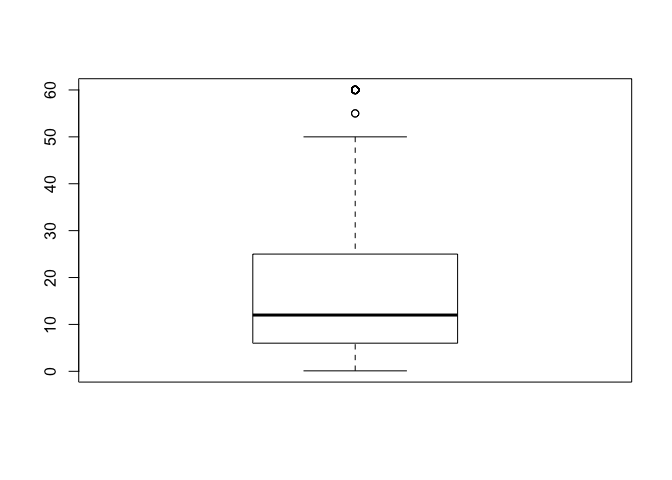

``` r
# 2-2. 2-1번에서 알아보고자 했던 지출액의 최소값, 중간값, 최대값, 평균 구하기
dvd <- data %>% 
  filter(dvd_spend_yesno == 1)
summary(dvd$dvd_spend)
```

    ##    Min. 1st Qu.  Median    Mean 3rd Qu.    Max.    NA's 
    ##    0.10    6.00   12.00   18.24   25.00   60.00     187

``` r
# 2-3. 경상소득에 따른 dvd_spend 지출 동향 분석 및 그래프 출력하기
data_dvd <- data %>% 
  filter(dvd_spend_yesno == 1) %>% 
  select(income, dvd_spend) %>% 
  group_by(income) %>% 
  summarise(mean_dvd = mean(dvd_spend, na.rm = T))
data_dvd
```

    ## # A tibble: 11 x 2
    ##    income mean_dvd
    ##     <int>    <dbl>
    ##  1      1     6.06
    ##  2      2    10.7 
    ##  3      3    14.4 
    ##  4      4    16.7 
    ##  5      5    16.9 
    ##  6      6    20.3 
    ##  7      7    20.5 
    ##  8      8    21.6 
    ##  9      9    20.0 
    ## 10     10    18.9 
    ## 11     11    26.5

``` r
ggplot(data = data_dvd, aes(x = income, y = mean_dvd)) + geom_col(color="white", fill=rgb(0.2,0.5,0.7,0.5))
```

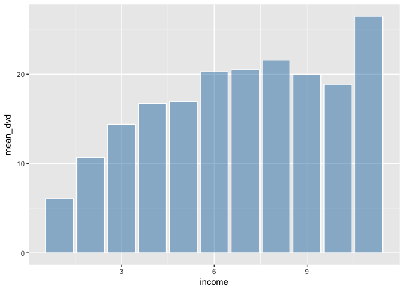

``` r
# 2-4 상관분석
cor.test(data$income, data$dvd_spend)
```

    ## 
    ##  Pearson's product-moment correlation
    ## 
    ## data:  data$income and data$dvd_spend
    ## t = 9.8869, df = 1725, p-value < 2.2e-16
    ## alternative hypothesis: true correlation is not equal to 0
    ## 95 percent confidence interval:
    ##  0.1864449 0.2757345
    ## sample estimates:
    ##       cor 
    ## 0.2315773

``` r
  # p값이 0.05보다 작으므로 유의미함 / cor값이 양수이므로 정적관계


# 3-1. h2_1 '박물관, 공연, 영화 관람료' 문항 지출여부에 '예'라고 답한사람들의 평균 지출액 구하기

  #결측값 0으로 바꿔주기(-9 = 결측값)
data$movie_spend <- ifelse(data$movie_spend == -9, 0, data$movie_spend)
  #결측치 몇개인지 알아보기(응답자 몇 가구인지 알아보기)
table(is.na(data$movie_spend))
```

    ## 
    ## FALSE  TRUE 
    ##  2490  2342

``` r
  #이상치 제거하기
boxplot(data$movie_spend)$stats
```

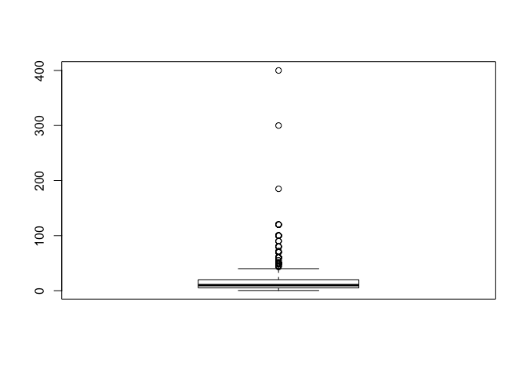

    ##      [,1]
    ## [1,]  0.3
    ## [2,]  5.0
    ## [3,] 10.0
    ## [4,] 20.0
    ## [5,] 40.0

``` r
data$movie_spend <- ifelse(data$movie_spend < 0.3 | data$movie_spend > 40, NA, data$movie_spend)
boxplot(data$movie_spend)
```

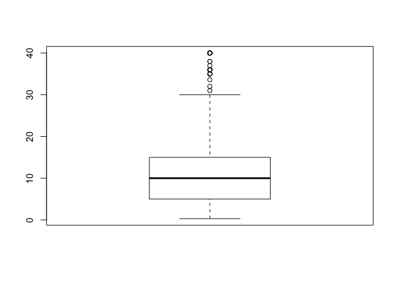

``` r
# 3-2. 3-1번에서 알아보고자 했던 지출액의 최소값, 중간값, 최대값, 평균 구하기
movie <- data %>% 
  filter(movie_spend_yesno == 1)
summary(movie$movie_spend)
```

    ##    Min. 1st Qu.  Median    Mean 3rd Qu.    Max.    NA's 
    ##    0.30    5.00   10.00   12.01   15.00   40.00     137

``` r
# 3-3. 경상소득에 따른 movie_spend 지출 동향 분석 및 그래프 출력하기
data_movie <- data %>% 
  filter(movie_spend_yesno == 1) %>% 
  select(income, movie_spend) %>% 
  group_by(income) %>% 
  summarise(mean_movie = mean(movie_spend, na.rm = T))
data_movie
```

    ## # A tibble: 11 x 2
    ##    income mean_movie
    ##     <int>      <dbl>
    ##  1      1       7.97
    ##  2      2       7.61
    ##  3      3       8.47
    ##  4      4      11.2 
    ##  5      5      11.8 
    ##  6      6      12.5 
    ##  7      7      14.2 
    ##  8      8      14.3 
    ##  9      9      15.1 
    ## 10     10      17.8 
    ## 11     11      17.1

``` r
ggplot(data = data_movie, aes(x = income, y = mean_movie)) + geom_col(color="white", fill=rgb(0.2,0.7,0.2,0.5))
```

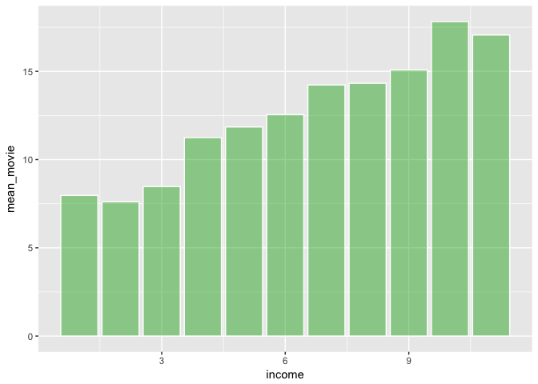

``` r
# 3-4 상관분석
cor.test(data$income, data$movie_spend)
```

    ## 
    ##  Pearson's product-moment correlation
    ## 
    ## data:  data$income and data$movie_spend
    ## t = 15.474, df = 2351, p-value < 2.2e-16
    ## alternative hypothesis: true correlation is not equal to 0
    ## 95 percent confidence interval:
    ##  0.2668966 0.3402554
    ## sample estimates:
    ##       cor 
    ## 0.3040266

``` r
  # p값이 0.05보다 작으므로 유의미함 / cor값이 양수이므로 정적관계


# 4-1. h3_1 '경륜, 경정, 경마권 구입료' 문항 지출여부에 '예'라고 답한사람들의 평균 지출액 구하기

  #결측값 0으로 바꿔주기(-9 = 결측값)
data$race_spend <- ifelse(data$race_spend == -9, 0, data$race_spend)
  #결측치 몇개인지 알아보기(응답자 몇 가구인지 알아보기)
table(is.na(data$race_spend))
```

    ## 
    ## FALSE  TRUE 
    ##     4  4828

``` r
    #응답한 가구가 4가구 밖에 되지 않아 분석이 무의미하다고 판단하여 분석에서 배제

# 4-2 상관분석
cor.test(data$income, data$race_spend)
```

    ## 
    ##  Pearson's product-moment correlation
    ## 
    ## data:  data$income and data$race_spend
    ## t = -0.4617, df = 2, p-value = 0.6896
    ## alternative hypothesis: true correlation is not equal to 0
    ## 95 percent confidence interval:
    ##  -0.9793293  0.9273369
    ## sample estimates:
    ##        cor 
    ## -0.3103509

``` r
  # p값이 0.05보다 커서 무의미함
    ## 또한 결측치가 너무 많아서 통계수치 무의미


# 5-1. h6_1 '체육, 음악, 문화 활동비 지출(수강료, 동호회비 등 포함)' 문항 지출여부에 '예'라고 답한사람들의 평균 지출액 구하기

  #결측값 0으로 바꿔주기(-9 = 결측값)
data$activity_spend <- ifelse(data$activity_spend == -9, 0, data$activity_spend)
  #결측치 몇개인지 알아보기(응답자 몇 가구인지 알아보기)
table(is.na(data$activity_spend))
```

    ## 
    ## FALSE  TRUE 
    ##   699  4133

``` r
  #이상치 제거하기
boxplot(data$activity_spend)$stats
```

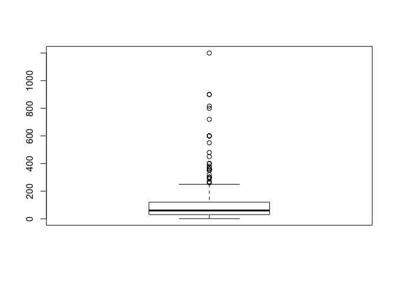

    ##      [,1]
    ## [1,]    1
    ## [2,]   30
    ## [3,]   60
    ## [4,]  120
    ## [5,]  250

``` r
data$activity_spend <- ifelse(data$activity_spend < 1 | data$activity_spend > 250, NA, data$activity_spend)
boxplot(data$activity_spend)
```

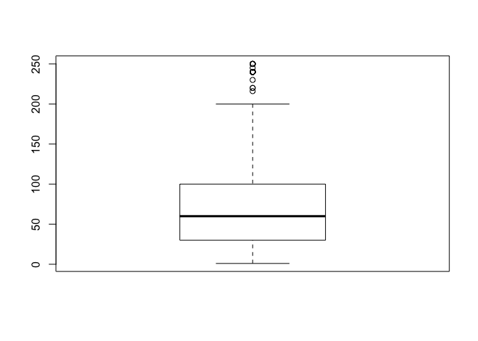

``` r
# 5-2. 5-1번에서 알아보고자 했던 지출액의 최소값, 중간값, 최대값, 평균 구하기
activity <- data %>% 
  filter(activity_spend_yesno == 1)
summary(activity$activity_spend)
```

    ##    Min. 1st Qu.  Median    Mean 3rd Qu.    Max.    NA's 
    ##    1.00   30.00   60.00   74.11  100.00  250.00      47

``` r
# 5-3. 경상소득에 따른 activity_spend 지출 동향 분석 및 그래프 출력하기
data_activity <- data %>% 
  filter(activity_spend_yesno == 1) %>% 
  select(income, activity_spend) %>% 
  group_by(income) %>% 
  summarise(mean_activity = mean(activity_spend, na.rm = T))
data_activity
```

    ## # A tibble: 11 x 2
    ##    income mean_activity
    ##     <int>         <dbl>
    ##  1      1          42.8
    ##  2      2          50.8
    ##  3      3          54.9
    ##  4      4          64.9
    ##  5      5          67.5
    ##  6      6          74.8
    ##  7      7          77.3
    ##  8      8          76.6
    ##  9      9          81.8
    ## 10     10         116. 
    ## 11     11         105.

``` r
ggplot(data = data_activity, aes(x = income, y = mean_activity)) + geom_col(color="white", fill=rgb(0.8,0.2,0.2,0.5))
```

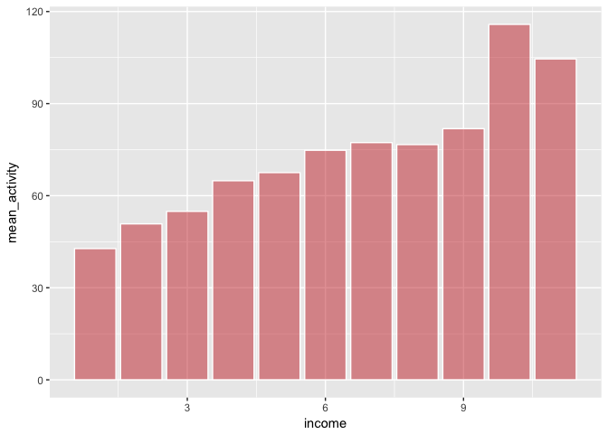

``` r
# 5-4 상관분석
cor.test(data$income, data$activity_spend)
```

    ## 
    ##  Pearson's product-moment correlation
    ## 
    ## data:  data$income and data$activity_spend
    ## t = 6.5957, df = 650, p-value = 8.775e-11
    ## alternative hypothesis: true correlation is not equal to 0
    ## 95 percent confidence interval:
    ##  0.1770800 0.3210678
    ## sample estimates:
    ##       cor 
    ## 0.2504584

``` r
  # p값이 0.05보다 작으므로 유의미함 / cor값이 양수이므로 정적관계


# 6-1. n1_1 '관광, 여행 및 숙박료(국내 및 국외)' 문항 지출여부에 '예'라고 답한사람들의 평균 지출액 구하기

  #결측값 0으로 바꿔주기(-9 = 결측값)
data$trip_spend <- ifelse(data$trip_spend == -9, 0, data$trip_spend)
  #결측치 몇개인지 알아보기(응답자 몇 가구인지 알아보기)
table(is.na(data$trip_spend))
```

    ## 
    ## FALSE  TRUE 
    ##  2458  2374

``` r
  #이상치 제거하기
boxplot(data$trip_spend)$stats
```

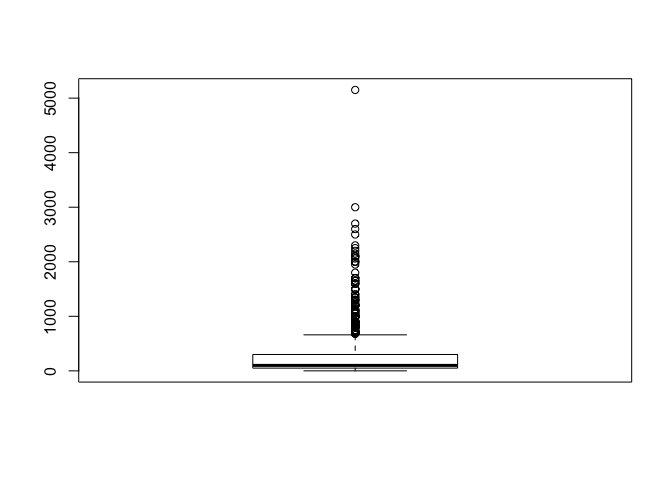

    ##      [,1]
    ## [1,]    0
    ## [2,]   50
    ## [3,]  100
    ## [4,]  300
    ## [5,]  660

``` r
data$trip_spend <- ifelse(data$trip_spend < 0 | data$trip_spend > 660, NA, data$trip_spend)
boxplot(data$trip_spend)
```

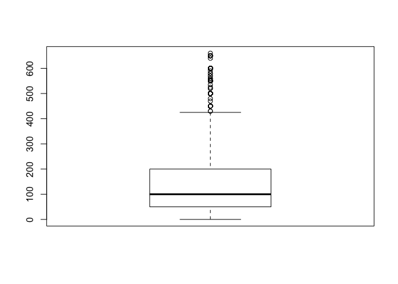

``` r
# 6-2. 2번에서 알아보고자 했던 지출액의 최소값, 중간값, 최대값, 평균 구하기
trip <- data %>% 
  filter(trip_spend_yesno == 1)
summary(trip$trip_spend)
```

    ##    Min. 1st Qu.  Median    Mean 3rd Qu.    Max.    NA's 
    ##     0.0    50.0   100.0   158.9   200.0   660.0     175

``` r
# 6-3. 경상소득에 따른 trip_spend 지출 동향 분석 및 그래프 출력하기
data_trip <- data %>% 
  filter(trip_spend_yesno == 1) %>% 
  select(income, trip_spend) %>% 
  group_by(income) %>% 
  summarise(mean_trip = mean(trip_spend, na.rm = T))
data_trip
```

    ## # A tibble: 11 x 2
    ##    income mean_trip
    ##     <int>     <dbl>
    ##  1      1      53.0
    ##  2      2      86.8
    ##  3      3     124. 
    ##  4      4     130. 
    ##  5      5     158. 
    ##  6      6     172. 
    ##  7      7     195. 
    ##  8      8     222. 
    ##  9      9     227. 
    ## 10     10     250. 
    ## 11     11     272.

``` r
ggplot(data = data_trip, aes(x = income, y = mean_trip)) + geom_col(color="white", fill=rgb(0.7,0.7,0.2,0.5))
```

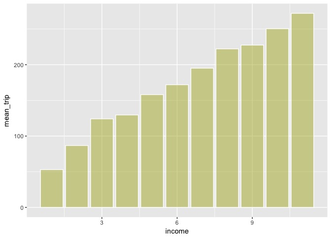

``` r
# 6-4 상관분석
cor.test(data$income, data$trip_spend)
```

    ## 
    ##  Pearson's product-moment correlation
    ## 
    ## data:  data$income and data$trip_spend
    ## t = 17.974, df = 2281, p-value < 2.2e-16
    ## alternative hypothesis: true correlation is not equal to 0
    ## 95 percent confidence interval:
    ##  0.3157593 0.3876433
    ## sample estimates:
    ##       cor 
    ## 0.3522206

``` r
  # p값이 0.05보다 작으므로 유의미함 / cor값이 양수이므로 정적관계


# 7. 소득분위별 가구당 가구원 수
data_member <- data %>% 
  filter(income != -9) %>% 
  group_by(income) %>% 
  summarise(mean_member = mean(member_n)) %>% 
  select(income, mean_member)
ggplot(data_member, aes(x = income, y = mean_member)) + geom_col(color="white", fill=rgb(0.9,0.3,0,0.5))
```

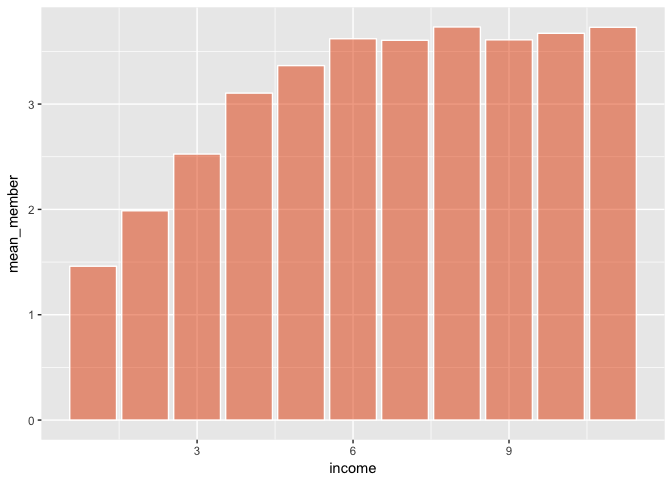

``` r
# 8. 소득분위별 소득이 있는 가구원 수
data_working <- data %>% 
  filter(income != -9) %>% 
  select(income, member_income) %>% 
  group_by(income) %>% 
  summarise(mean_workingmember = mean(member_income))
ggplot(data_working, aes(x = income, y = mean_workingmember)) + geom_col(color="white", fill=rgb(0.3,0.5,1,0.7))
```

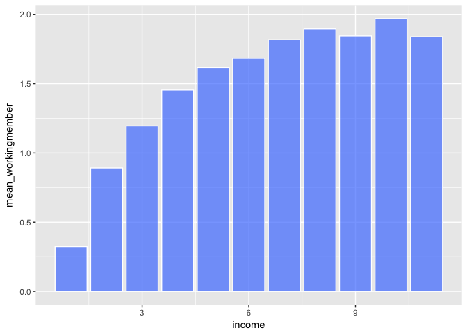

``` r
# 9. 종합 결과그래프 만들기 위한 모든 변수 데이터 합치기
data_total <- left_join(data_dvd, data_movie, by = "income")
data_total <- left_join(data_total, data_activity, by = "income")
data_total <- left_join(data_total, data_trip, by = "income")
data_total <- data_total %>% 
  select(mean_dvd, mean_movie, mean_activity, mean_trip)

# 10. 종합 결과그래프 출력하기
rownames(data_total)=c("below 100","100~199","200~299","300~399","400~499","500~599","600~699","700~799","800~899","900~999","above 1000")
```

    ## Warning: Setting row names on a tibble is deprecated.

``` r
barplot(t(data_total), main = "Total Gragh", col=colors()[c(2,6,3,15)])
legend(0.1, 400, c("dvd", "movie", "activity", "trip"), fill = colors()[c(2,6,3,15)])
```

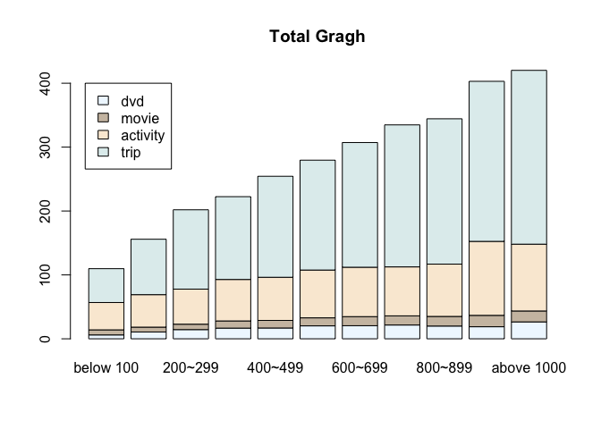

``` r
# 11. 가구원 수로 나눈(1인당 지출비) 종합 결과그래프 출력하기 위해 데이터 가공하기
  # 11-1 dvd가공
data_total2 <- left_join(data_dvd, data_member, by = "income")
divided_dvd <- data_total2 %>% 
  mutate(member_dividing_dvd = mean_dvd / mean_member) %>% 
  select(income, member_dividing_dvd)
  # 11-2 movie가공
data_total3 <- left_join(data_movie, data_member, by = "income")
divided_movie <- data_total3 %>% 
  mutate(member_dividing_movie = mean_movie / mean_member) %>%
  select(income, member_dividing_movie)
  # 11-3 activity가공
data_total4 <- left_join(data_activity, data_member, by = "income")
divided_activity <- data_total4 %>% 
  mutate(member_dividing_activity = mean_activity / mean_member) %>%
  select(income, member_dividing_activity)
  # 11-4 trip가공
data_total5 <- left_join(data_trip, data_member, by = "income")
divided_trip <- data_total5 %>% 
  mutate(member_dividing_trip = mean_trip / mean_member) %>%
  select(income, member_dividing_trip)

# 12. 가구원 수로 나눈(1인당 지출비) 각각의 그래프 출력하기
ggplot(data = divided_dvd, aes(x = income, y = member_dividing_dvd)) + geom_col(color="white", fill=rgb(0.2,0.5,0.7,0.5))
```

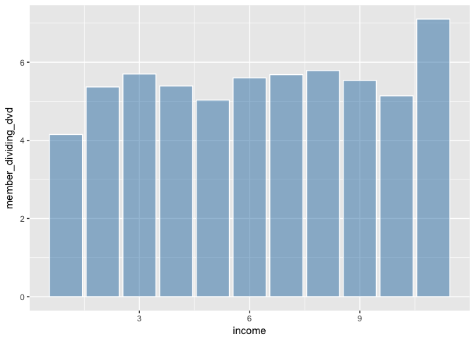

``` r
ggplot(data = divided_movie, aes(x = income, y = member_dividing_movie)) + geom_col(color="white", fill=rgb(0.2,0.7,0.2,0.5))
```

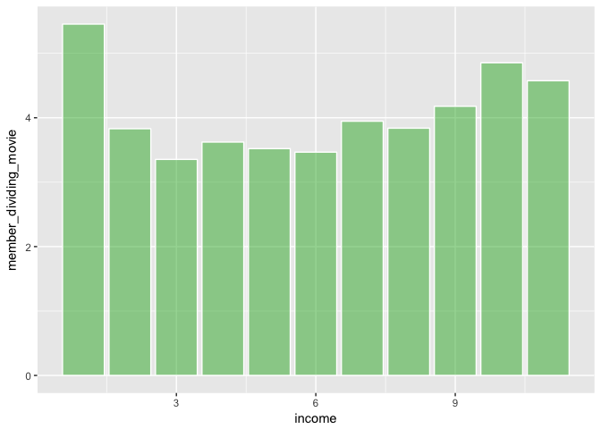

``` r
ggplot(data = divided_activity, aes(x = income, y = member_dividing_activity)) + geom_col(color="white", fill=rgb(0.8,0.2,0.2,0.5))
```

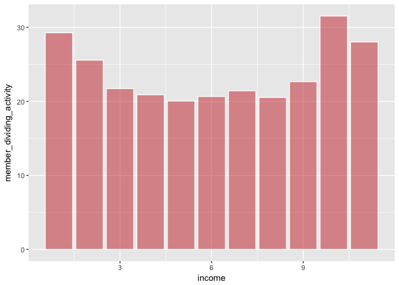

``` r
ggplot(data = divided_trip, aes(x = income, y = member_dividing_trip)) + geom_col(color="white", fill=rgb(0.7,0.7,0.2,0.5))
```

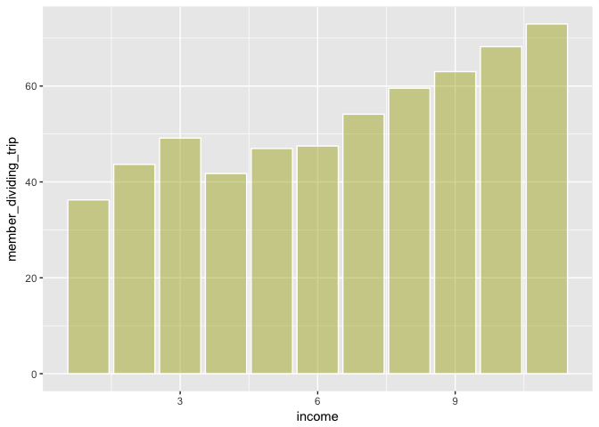

``` r
# 13. 가구원 수로 나눈(1인당 지출비) 종합 결과그래프 출력하기
data_total_divided <- left_join(divided_dvd, divided_movie, by = "income")
data_total_divided <- left_join(data_total_divided, divided_activity, by = "income")
data_total_divided <- left_join(data_total_divided, divided_trip, by = "income")
data_total_divided <- data_total_divided %>% 
  select(member_dividing_dvd, member_dividing_movie, member_dividing_activity, member_dividing_trip)

rownames(data_total_divided)=c("below 100","100~199","200~299","300~399","400~499","500~599","600~699","700~799","800~899","900~999","above 1000")
```

    ## Warning: Setting row names on a tibble is deprecated.

``` r
barplot(t(data_total_divided), main = "Total Gragh(per person)", col=colors()[c(2,6,3,15)])
legend(0.1, 116, c("dvd", "movie", "activity", "trip"), fill = colors()[c(2,6,3,15)])
```

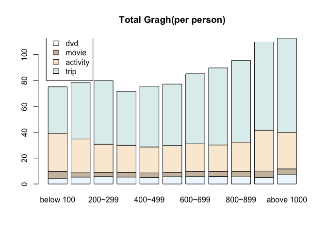
